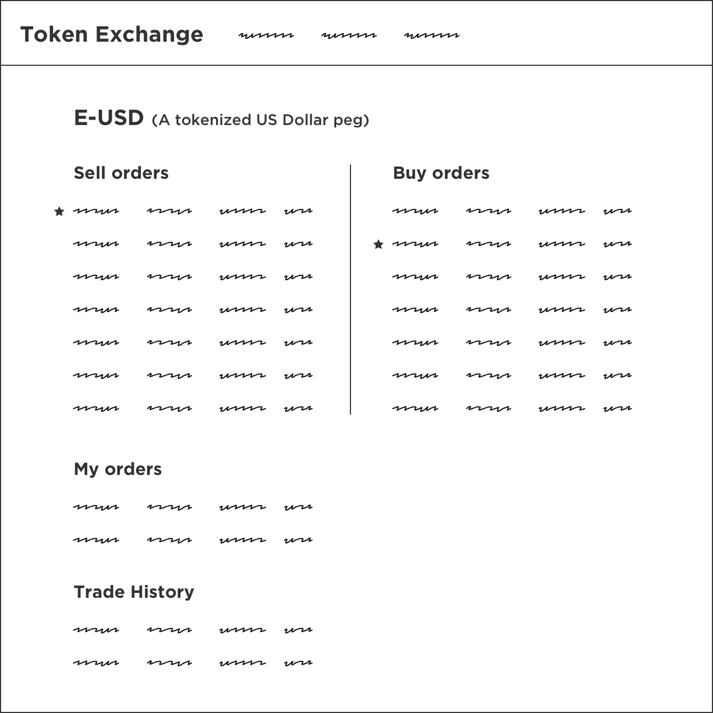
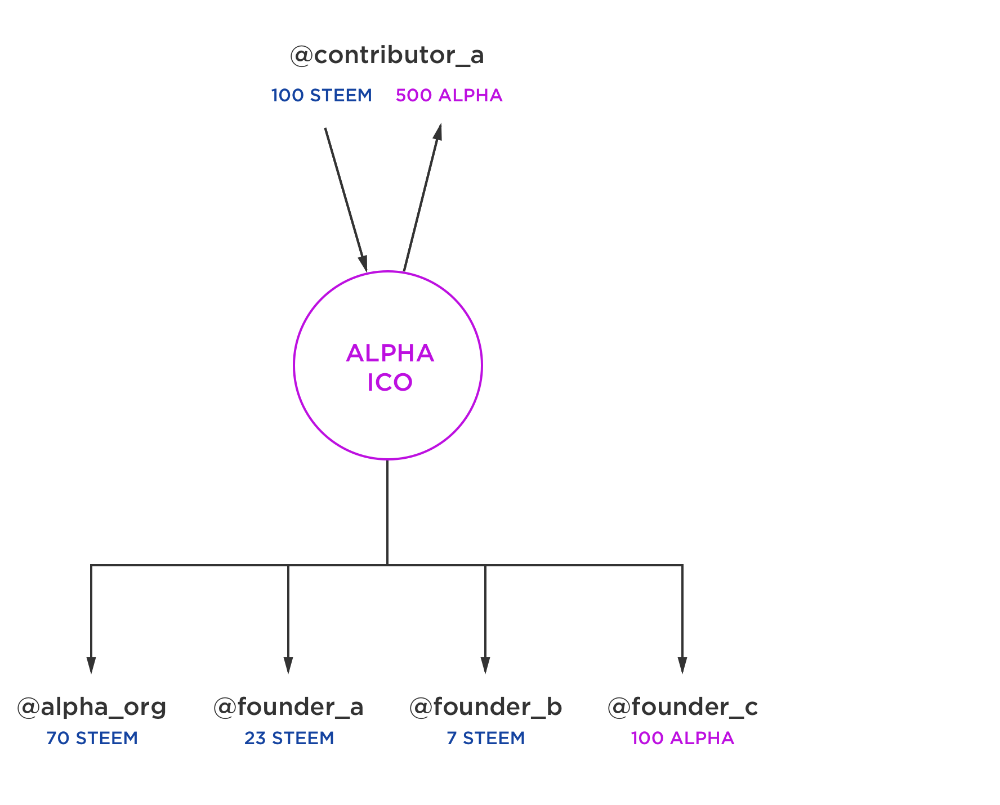
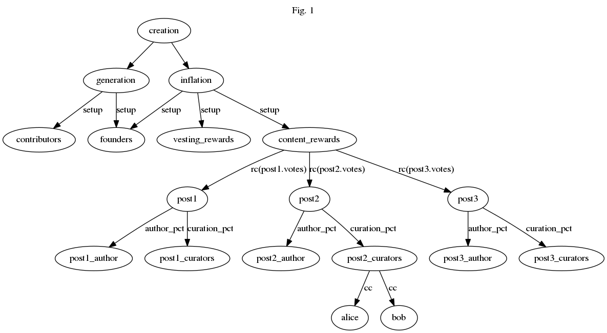
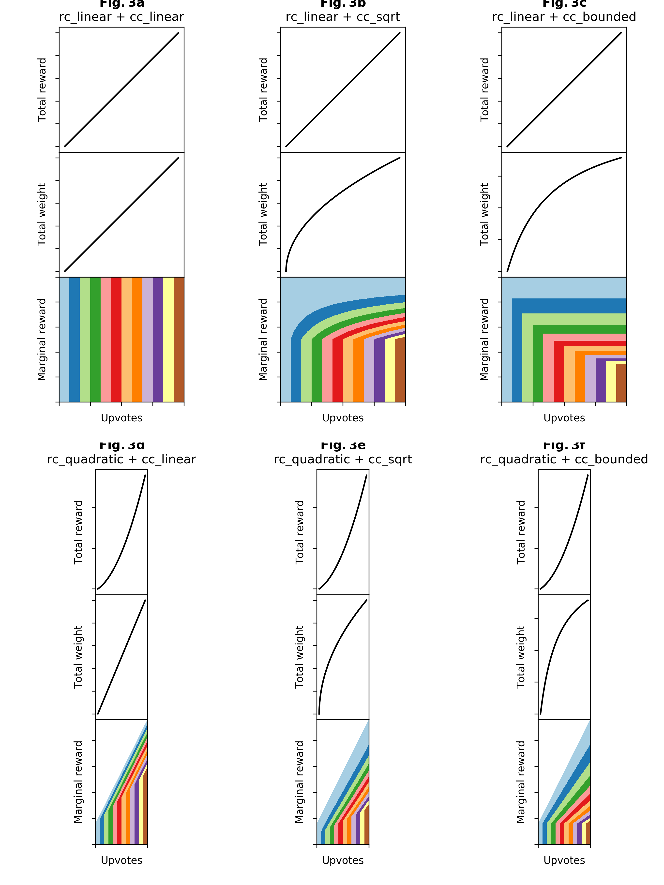
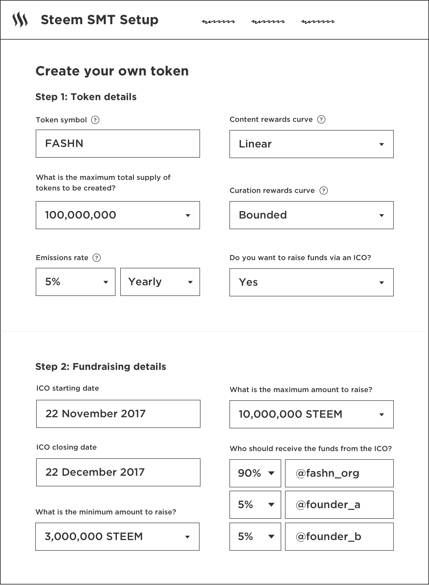
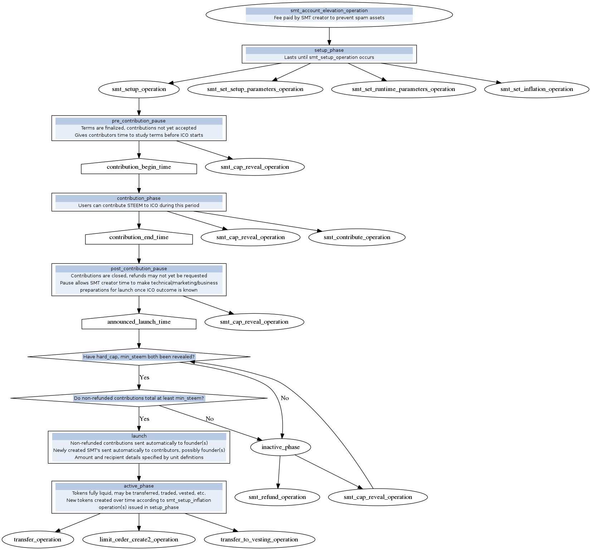

---
header-includes:
    - \renewcommand{\contentsname}{Table of Contents}
    - \usepackage[top=3cm,bottom=3.5cm,left=4cm,right=4cm]{geometry}
urlcolor: blue
linkcolor: blue
---

# Document Metadata

* Creators: @ned; @theoretical
* Developers: @theoretical; @vandeberg; @youkaicountry; @stevegerbino
* Contributors: @vandeberg; @valzav; @youkaicountry; @justinw;
  @goldibex; et al.
* Sketch designs: @pkattera
* Copyright (c) Steemit, Inc. 2017 - 2018
* GitHub: [https://github.com/steemit/smt-whitepaper/blob/master/smt-manual/manual.md](https://github.com/steemit/smt-whitepaper/blob/master/smt-manual/manual.md)

# Smart Media Tokens (SMTs)

## A Token Protocol for Content Websites, Applications, Online Communities and Guilds Seeking Funding, Monetization and User Growth

[Steem's](https://steem.io/steem-bluepaper.pdf) Smart Media Tokens (SMTs)
give anyone the power to launch and sell [Proof-of-Brain
[1]](https://steem.io/steem-bluepaper.pdf) tokens, which are tokens
distributed by "upvote" and "like"-based algorithms and can be integrated
with websites to align incentives and spur growth, while websites are
empowered to adopt sustainable, currency-centric revenue models. This model
has been tested and continues to be proven by
[steemit.com](https://steemit.com), [busy.org](https://busy.org),
[chainbb.com](https://chainbb.com), [dsound.audio](https://dsound.audio),
[dtube.video](https://dtube.video) and other Steem interfaces, which are
monetizing content, tokens and media in a way never before seen.

Several popular token protocols, such as Ethereum's ERC-20, allow you to
create and launch arbitrary tokens, but no protocol enables content
businesses to leverage those tokens by aligning incentives between users and
applications. Due to suboptimal transaction cost structures that incur fees
for basic actions such as voting or posting, misalignment of interests
between meta and core tokens that aren’t built for influencing distributions
based on Proof-of-Brain, private key hierarchies that don’t cater to social
versus financial operations, and slow transaction speeds that are out of
sync with real-time websites - none of these protocols could ever provide an
acceptable user experience for content websites, such as Twitter, Reddit
(even subreddits) or The New York Times.

For content websites and tokens, incentive alignment between websites and
users comes from a steady, as well as decentralized and mathematically
guaranteed, release of new tokens, and incentives that must be allocated to
the users - including bloggers, vloggers, commenters and curators. The
distribution of new tokens occurs based on stake-weighted voting to prevent
gaming and eliminate the need for a counterparty. Quality user experience
comes from tokens that can be transacted safely (through separate private
keys for distinct sets of actions), without fees, and at real-time speeds.
Further incentive alignment comes from a company’s ability to raise capital
in ICOs. All Smart Media Tokens have built-in ICO support, should the issuer
wish to launch one.

\tableofcontents
\newpage

# Introduction

Smart Media Tokens (SMTs) is a proposal to build a consensus-level token
issuance protocol on the Steem blockchain. Inspired by the revolutionary
properties of the STEEM token, including automatic distributions to content
creators, SMTs will be an upgrade beyond previously created blockchain token
issuance protocols due to carefully designed token sale programmability,
automated liquidity providers, decentralized token markets and dynamic token
distribution parameters, as well as a large ecosystem of tools (open source
wallets, shared key signing tools, etc.) for integrations at website and
application layers.

SMTs are an evolution of the successful relationship established between
STEEM and the social websites sitting atop of it, such as
[steemit.com](https://steemit.com), which has grown to be a top 2100 website
in Alexa rankings in less than one year, solely from integrating the
incentive model of STEEM. With SMTs, any website or content library across
the internet may have one or more tokens integrated into its interface to
facilitate fundraising and autonomous growth.

These tokens are designed to allow website operators flexibility during the
integration of the token into their community by choosing from many
parameters that may be structured creatively at outset or refined over time.
Any tokens launched as SMTs shall benefit from a blockchain ecosystem built
with an inbuilt decentralized exchange, as well as an ecosystem of
open-source applications and libraries to support successful deployment,
fundraising, and growth.

## Leveraging Tokens for Autonomous User Growth

SMTs are a breakthrough for bridging the world's content applications to
tokens in a way that aligns incentives between the users of a network and
the entrepreneurs building the applications. By leveraging the concepts of
inflation (new token emissions) and token allocations by post-based voting,
SMTs exist in a manner where value must be distributed to users who are
participating in their related content networks and applications.
Entrepreneurs may now create tokens to integrate with their blog,
application, or an entire network of applications and topics. With SMTs, the
entrepreneurs have the flexibility to decide on the economics of the tokens
they integrate into their products, from the inflation rates to the
algorithms that distribute the tokens.

Two unique properties align incentives and make SMTs “smart and social”
compared to other tokens (such as bitcoin, ether and ERC-20s). The first is
a pool of tokens dedicated to incentivizing content creation and curation
(called the “rewards pool”). The second is a voting system that leverages
the wisdom of the crowd to assess the value of content and distribute tokens
to it. These two unique properties when combined are referred to as
Proof-of-Brain, which is an entendre based on Proof-of-Work, meant to
emphasize the human work required to distribute tokens to community
participants. Proof-of-Brain positions SMTs as a tool for building
perpetually growing communities, which encourage their members to add value
to the community through the built in rewards structure.

Entrepreneurs and established entities may rely on SMTs to grow their
content network because of the automated and continuous generation of new
tokens that are allocated to producers of content by the holders of the
existing tokens, through the process of competitive voting. As the tokens
are distributed to users of the network, the interests of existing token
holders are further aligned with content creators, the businesses running
the applications, and the entrepreneurs that support them. These unique
properties of the tokens’ economics continue to provide incentives for new
users to join and participate in growing the network. Any application,
whether it is an existing publisher behemoth or a stealth-mode social media
startup, will be able to integrate and leverage these special tokens for
their own growth.

## New Fundraising Opportunities

Blockchain-based tokens, beginning strongly with the advent of ERC20 on
Ethereum, represent a new manner of bringing capital into an organization
through the process of Initial Coin Offerings (ICOs). ICOs are an
opportunity for one group to sell an initial supply of tokens, privately or
publicly, for-specific-purpose, for-profit or not-for-profit. Depending on
how these tokens are sold, different regulatory bodies could see them as
commodities, securities, derivatives, or as none of the above. Regardless,
it is clear we have seen north of one billion dollars (USD) raised through
ICOs in 2017, and to support this trend, it is possible to conveniently
launch and sell tokens via the built in ICO contract of SMTs. The launch of
SMTs can be structured for ICOs with hard, soft, and no caps, and can be
tailored to receive STEEM and cryptocurrencies on other blockchains.

## Immediate Liquidity

By leveraging a recently designed automated market maker concept
[[2](https://about.bancor.network/static/bancor_protocol_whitepaper_en.pdf)],
SMT-based ICOs allow a portion of STEEM tokens received to be sent into an
SMT’s on-chain, off-order-book market maker in order to provide liquidity to
the SMT at a specified reserve ratio. Beyond the social and specialized
distribution mechanisms of SMTs, this feature advances the concept of
automated market makers by pairing it alongside SMT's decentralized markets,
which also facilitate bids and asks by human participants.  The combination
of these two markets enables on-chain and trustless exchange opportunities
for market makers while enabling liquidity for token users.

## Shared Bootstrap Tools

SMTs may be created with [reward pool](https://steem.io/steem-bluepaper.pdf)
parameters tuned for "Shared Influence" between Steem Power and other
vesting SMTs, which means a SMT creator may specify that Steem Power can
control a portion of the SMT's rewards pool for an unlimited or limited
amount of time, with increasing or decreasing influence. Altogether, Shared
Influence may allow SMTs to be wholly or partially bootstrapped by the
interest of existing and active Steem or other SMT community members.
Through these tools, community managers and entrepreneurs launching a token
may leverage existing user bases to accelerate the distribution of the SMT
to a target market.

## Monetizing with Shared Token Rewards

All Steem based interfaces have the option of splitting token rewards among
a set of arbitrary recipients, which could include an interface, community
manager, referrer, a paid position donation pool, and more. An interface can
also provide this optionality of how to split the tokens to the authors. The
number of potential Reward Sharing beneficiaries is initially soft capped by
block producers at eight while the feature proves its use, however the
blockchain is capable of handling up to 256 beneficiaries per post.

## Can My Entity Participate in SMTs?

An SMT can be launched by a person or entity; they only need 1 USD to cover
the network fee (this fee prevents spam and unused tokens while accruing
value to the network), and a namespace on Steem - which can be obtained by
registering at [anon.steem.network](https://anon.steem.network),
[steemit.com](https://steemit.com),
[steemconnect.com](https://v2.steemconnect.com), or any other Steem sign-up
service.

Once an account name to register the token with is secured, the account
issues the token by using a Steem-based command line tool or any tool
created in the future to support token launches.  The token can be
structured to support an initial sale or distribution of the token. Certain
properties of an SMT, such as its inflation rate, must also be defined by
the person or entity creating the token. These properties dictate how the
token is used inside applications and respective communities.

From launch, the token becomes immutable on the blockchain, and leveraged
correctly, the token can have dramatic effects on the growth of businesses
that choose to integrate these tokens.

## Use Cases

We have identified five ways in which existing businesses and future
entrepreneurs can leverage specially designed SMTs to transform the
internet. Among these use cases you may discover other ways of structuring
and leveraging tokens inside applications. This list is by no means
exhaustive, and we will update this paper as more use cases demonstrate
their value.

### 1 - Content Publishers - Single Token Support

A mainstream media website's growth has been slowing and they are looking
for ways to get ahead of the changing tech landscape. The website migrates
to a Disqus-like application based on Steem, or taps directly into Steem
APIs for a custom integration. Now their subscribers can be rewarded with
cryptocurrency while commenting. When the website is ready, they can issue
their own token through the comments interface - the token will allow them
to 1) raise capital by selling tokens 2) catalyze autonomous growth.


\begin{center}Figure 1: Single Token Content Publishers\end{center}

### 2 - Forums - Multiple Token Support

An up-and-coming forum business is looking to integrate cryptocurrency to
create cash flow and spark growth to get the business to the next level,
however they are not cryptocurrency security experts and would prefer not to
host a cryptocurrency wallet. They issue an SMT and integrate it into their
website. Focusing solely on the social aspects, the forum business can
integrate other applications, such as SteemConnect into their forum to
handle the wallet and transfer capabilities. This allows them to focus on
their business (growing communities) without focusing on the security
aspects of cryptocurrency. The forum enables additional tokens to be exposed
or launched, to represent specific topics of discussion. The ability to
launch these tokens can be retained by the company behind the website, or
granted to the website's community managers. Tokens dedicated to the
website's specific topics will further spur autonomous growth of the website
niche by niche. An example of this multi-token model could eventually be
found in organizations such as ChainBB ([chainbb.com](https://chainbb.com))
if it were to enable its own globally available token on its domain, as well
as narrowly available tokens for specific community niches - such as
"gardening."


\begin{center}Figure 2: Multiple tokens Forum\end{center}

### 3 - Comments Widget for Online Publishers

One of the ways in which publishers will be onboarded faster to SMT
integrations is by offering a Steem-based comments widget that can easily be
integrated into existing blogs that are built on software such as WordPress
and Blogger. The developer employing the widget would be able to take a
percentage of the tokens (called “Shared Rewards”) distributed to the
commenters for themselves, thereby creating a business opportunity for the
next generation of Disqus-like companies that are cryptocurrency enabled. It
would alleviate the burdens of transaction signing support, private key
management, wallet functionality, and hosting costs for the publisher - by
outsourcing all of these functions to the comments widget maintainer.


\begin{center}Figure 3: Comment Widget\end{center}

### 4 - Sub-Community Moderators and Managers

Imagine you are a moderator for a specific topic inside a forum, such as a
Reddit "subreddit" or a Steemit "community". If a website integrates SMTs
for these specific topics, then the topic moderator/s can launch these
tokens to empower the subscribers of their topic, raise funds, and increase
the quality of content curation for the community.


\begin{center}Figure 4: Sub-community\end{center}

### 5 - Arbitrary Assets - Tokens Representing Real World Assets

Let's examine an instance in which an entrepreneur is looking to provide
liquidity in the Steem ecosystem. The entrepreneur can issue an SMT without
inflation properties, and imply that they will provide structure to peg it
to USD (or any other debt, contract, or asset), making it like an IOU or
basic derivative. The structure they provide to the asset includes buying
and selling it near $1, similar to Tether. The entrepreneur sets up bank
wire capabilities for buying and selling, and takes a small % on each
transaction. The derivative trades against STEEM, and also brings capital
into the ecosystem to be used across all tokens.


\begin{center}Figure 5: IOU Asset Token Exchange\end{center}

# Owner's manual

This manual will explain the nuts and bolts of how SMTs work. The intended
audience is technical users who want to create their own SMT.

## Create a control account

The first step to creating an SMT is to create a *control account* for the
SMT.  Any STEEM account may serve as a control account, however it is highly
recommended to create a dedicated account solely for the purpose. It is also
highly recommended that a control account does not post, vote, or hold any
STEEM, SBD, or other tokens (other than a small amount of STEEM power for
transaction bandwidth).

The control account's name will not occupy a high visibility position in
most user interfaces, so it does not much matter if the control account's
name is not the best match for the SMT brand.

### Control account security

Security on the control account is important for persons who plan to use the
account post launch:

- The control account should use 2-of-3 or 3-of-5 multi-signature security.
- The control account's authorities should have other accounts, not specific
  keys, as multi-signature members.
- For additional security, each of the accounts in the control account's
  multi-signature group should itself use multi-signature security.
- A subset of keys should be kept offline, in air-gapped machines.
- Transactions should be generated by an online interface, and physically
  transferred to the
  air-gapped machines via removable media.
- Signatures should be returned via physically removable media to
  the online system for transmission via the UI.

Of course, once authorities are set up, you should verify the account is
still able to transact. It is advisable to test your authorities and
transaction signing setup using a testnet, or a less-important account on
the main network.

Once the token is launched, you may consider burning the account's keys by
assigning them to @null, initiating a token for which the dynamic
properties can never be adjusted.

### Token consensus

Since tokens participate in atomic transactions also involving STEEM, they
have been designed as part of the STEEM blockchain's consensus.

## Token Generation and Initialized Parameters

### SMT object creation

The first operation to be executed is an `smt_create_operation`. This
operation creates an SMT object in the blockchain state. After executing the
`smt_create_operation`, the newly created SMT object is not yet fully
configured.

Most of the configuration occurs in subsequent operations
(`smt_set_setup_parameters_operation`, `smt_setup_inflation_operation` and
`smt_setup_operation`). These later operations may occur in the same
transaction, but they may also occur at any later point in time.

```
struct smt_create_operation
{
   account_name_type control_account;
   asset             smt_creation_fee;
   asset_symbol_type symbol;
   extensions_type   extensions;
};
```

#### Numerical asset identifiers

An SMT is referred to by a *numerical asset identifier* or NAI, consisting
of two at-signs followed by nine decimal digits, for example `@@314159265`.
The blockchain enforces that the identifier placed by a UI into the
`smt_create_operation` must match a result from the
`get_nai_pool` RPC. Therefore, an NAI cannot be chosen freely by
the SMT creator. It is not even possible to "mine" a "vanity NAI" (analogous
to the "vanity Bitcoin address" some people use).

The reason for this restriction is that the blockchain designers want to
discourage users from using the consensus level identifiers as symbol names,
and instead use a non-consensus directory system to attach human meaningful
symbols to assets. Distinguishing a "namesquatter" from the legitimate owner
of a brand is not something that a blockchain can do, especially if the
squatter is willing to pay the SMT creation fee.

#### SMT naming

The solution to the namesquatting problem is to publish an *asset directory*
mapping NAIs to names.  An asset directory is *non-consensus*, meaning that
all blockchain operations are serialized only with NAIs. Asset names are only
used for UI presentation.

A UI may include an asset directory as a file, URL, or a blockchain account
which publishes directory entries with custom operations. The publisher of
an asset directory should ensure that directory entries meet whatever
standards of legitimate brand ownership the publisher chooses to enforce.

#### SMT creation fee

Issuing a `smt_create_operation` requires payment of `smt_creation_fee`. The
amount required is set by the `smt_creation_fee` field of
`dynamic_global_properties_object`. This field may contain a value in STEEM
or SBD. If `smt_creation_fee` is specified in SBD, an equivalent amount of
STEEM will be accepted at the current price feed; likewise, if
`smt_creation_fee` is specified in STEEM, an equivalent amount of SBD will
be accepted at the current price feed.

Initially, `smt_creation_fee` will be set to 1 SBD, and no means will be
provided to update it. Updates to the `smt_creation_fee` amount may occur in
future hardforks, however, so user-agents should read the `smt_creation_fee`
value from the `dynamic_global_properties_object`. User-agents should not
assume the fee will always be 1 SBD and they should be prepared to charge a
separate fee paid to the user-agent if the aim of the interface is to enable
only a curated set of tokens.

The fee is destroyed by sending it to `STEEM_NULL_ACCOUNT`.

### SMT pre-setup

Two pre-setup operations are included: `smt_setup_inflation_operation` and
`smt_setup_parameters`. These operations must be issued after
`smt_create_operation`, and before `smt_setup_operation`. They may be issued
in the same transaction, or in prior blocks.

The reason pre-setup operations are not made a part of `smt_setup_operation`
is to allow a large number of pre-setup operations to be executed over
multiple blocks.

### SMT setup

Each SMT has an associated descriptor object which has *permanent
configuration data*. This data cannot be changed after launch! The
descriptor is set by the `smt_setup_operation`:

```
struct smt_setup_operation
{
   account_name_type       control_account;
   asset_symbol_type       smt_name;
   int64_t                 max_supply = STEEM_MAX_SHARE_SUPPLY;

   smt_generation_policy   initial_generation_policy;

   time_point_sec          generation_begin_time;
   time_point_sec          generation_end_time;
   time_point_sec          announced_launch_time;
   time_point_sec          launch_expiration_time;

   extensions_type         extensions;
};
```

The symbol precision in `smt_setup_operation` is authoritative. It may
differ from, and will override, any previously specified operations'
precision. Subsequently issued operations must have matching precision.

The operation must be signed by the `control_account` key. The named SMT
must have been created earlier by the `control_account`. The symbol's
embedded decimal places may be distinct from prior `smt_setup_operation`.

The `decimal_places` field is used by UIs to display units as a number of
decimals.

The `generation_begin_time` is when participants can begin to contribute to
the ICO. It is allowed to be in the future so users have time to study the
ICO's final terms before the ICO begins.

The `generation_end_time` is when the ICO stops accepting contributions, and
the `announced_launch_time` is when the ICO token is created (assuming the
ICO reached the minimum participation level). Some pause is allocated
between the `generation_end_time` and `announced_launch_time` to allow for
the possibility of ICOs that wish to have hidden caps that aren't revealed
while the ICO is open for contributions. It also gives the ICO creator time
to use the final ICO numbers to aid in pre-launch business activities.

At `launch_expiration_time`, if the ICO has not yet launched, all
contributors will be automatically refunded (with virtual operations) and
the ICO will be cancelled. The symbol will remain reserved to the specified
`control_account`. However, in order to launch the token, an
`smt_create_operation` must be issued and the `smt_creation_fee` must be
paid again.

### Token units

Initial token generation is driven by a contributions of *STEEM units* from
contributors. To simplify rounding concerns, a contribution must be an
integer number of STEEM units. The ICO creator sets the size of a STEEM unit
- it can be large or small. It is better to keep the unit small (for
example, 1 STEEM or 0.1 STEEM), as this allows the ICO to be accessible to
the maximum possible audience.

A STEEM unit also specifies a *routing policy* which determines where the
STEEM goes when the token launches. (STEEM for tokens which do not launch
may be refunded on demand.) The routing policy may split the STEEM in the
unit among multiple parties.

When the ICO occurs, the tokens are generated in *token units*. Multiple
token units are generated per STEEM unit contributed. Token units also have
a routing policy.

The units and their routing policies are specified in the `smt_generation_unit` structure:

```
struct smt_generation_unit
{
   flat_map< account_name_type, uint16_t >        steem_unit;
   flat_map< account_name_type, uint16_t >        token_unit;
};
```

Each `(key, value)` pair in the `flat_map` determines the routing of some
satoshis. The total STEEM/tokens in each unit is simply the sum of the
values.

### Unit ratios

When an SMT launches, token units are created for STEEM units in a R-for-1
ratio. The number R is called the *unit ratio*. Maximum and minimum
allowable values for R are specified respectively in the `min_unit_ratio`
and `max_unit_ratio` fields of `smt_generation_policy`.

The maximum number of token units that can be created in the ICO is limited
to `max_token_units_generated`, a parameter which is set by the ICO creator.
(More tokens can be created after the token has launched, but this later
creation is called *inflation* and is not considered to be part of the ICO.)

The unit ratio is set to the largest integer that would not result in
exceeding `max_token_units_generated` for the number of STEEM units actually
contributed.

### Cap and min

ICOs may specify a minimum number of STEEM units `min_steem_units`. If the
ICO does not reach `min_steem_units` before `generation_end_time`, then it
does not occur, and contributors become eligible for refunds.

Likewise, ICOs may specify two maximum numbers of STEEM units: A *hard cap*
and a *soft cap*. Units in excess of the soft cap have different routing for
their STEEM and tokens. STEEM units in excess of the hard cap are rejected
and do not generate any SMTs.

The effects of the soft cap are divided proportionally among all
contributors. I.e. if a ICO has a soft cap of 8 million STEEM, and 10
contributors each contribute 1 million STEEM, then 0.2 million of *each
user's* STEEM is routed via the soft cap's policy.

The effects of the hard cap fall solely on the last contributors. I.e. if a
ICO has a hard cap of 8 million STEEM, and 10 contributors each contribute 1
million STEEM, then the first 8 users fully participate in the ICO, and the
last 2 users are refunded 1 million STEEM.

### Hidden caps

The min and hard caps are *hidden* in the generation policy. This means that
these numbers are fixed at setup time, but the ICO creator has the option to
keep them secret. This functionality is implemented by a *commit/reveal*
cryptographic protocol: A hash called the *commitment* is published at setup
time, and the actual amount must match the commitment. (A nonce is also
included in the hash to prevent an attacker from finding the hidden cap with
a brute-force guess-and-test approach.)

The SMT designer may wish to pre-publish a guarantee that the hidden values
are within a certain range. The `lower_bound` and `upper_bound` fields
provide this functionality: A revealed amount that is not in the specified
range is treated the same as a hash mismatch.

```
struct smt_cap_commitment
{
   share_type            lower_bound;
   share_type            upper_bound;
   digest_type           hash;
};

struct smt_revealed_cap
{
   share_type            amount;
   uint128_t             nonce;
};

struct smt_cap_reveal_operation
{
   account_name_type     control_account;
   smt_revealed_cap      cap;

   extensions_type       extensions;
};
```

All caps are hidden, but the cap may be revealed at any point in time.
Therefore, an ICO with a non-hidden minimum or cap may be implemented by
simply including the `smt_cap_reveal_operation` in the same transaction as
the `smt_setup_operation`. UIs should provide functionality for this.

A UI should provide one or more of the following means to ensure the `nonce`
and `amount` are recoverable:

- Force the user to type in the `amount` and `nonce` again, as confirmation
  they have been backed up.
- Set `nonce` to some deterministic function of the private key and public
  data, for example `nonce = H(privkey + control_account + lower_bound +
  upper_bound + current_date)`.
- Provide functionality to brute-force the uncertain fields when the nonce
  is known (e.g. the current date and `amount`).
- Require the amount to be low-entropy to facilitate brute-forcing when the
  nonce is known (e.g. a number between 1-999 times a power of 10).

### Generation policy data structure

The SMT generation policy data structure looks like this:

```
struct smt_capped_generation_policy
{
   smt_generation_unit pre_soft_cap_unit;
   smt_generation_unit post_soft_cap_unit;

   smt_cap_commitment  min_steem_units_commitment;
   smt_cap_commitment  hard_cap_steem_units_commitment;

   uint16_t            soft_cap_percent = 0;

   uint32_t            min_unit_ratio = 0;
   uint32_t            max_unit_ratio = 0;

   extensions_type     extensions;
};
```

Note, the `max_token_units_generated` parameter does not appear anywhere in
the operation. The reason is that it is actually a derived parameter:
`max_token_units_generated = min_unit_ratio * hard_cap_steem_units`.

Additionally, the `smt_generation_policy` is defined as a `static_variant`,
of which `smt_capped_generation_policy` is the only member:

```
typedef static_variant< smt_capped_generation_policy > smt_generation_policy;
```

This `typedef` allows the potential for future protocol versions to allow
additional generation policy semantics with different parameters.

### Examples and rationale

#### Example ICO

ALPHA wants to sell a token to the crowd to raise funds where: 70% of
contributed STEEM goes to the Alpha Organization Account (@alpha_org), 23%
of contributed STEEM goes to Founder Account A (@founder_a), and 7% of
contributed STEEM goes to Founder Account B (@founder_b).

ALPHA defines a STEEM unit as:

```
steem_unit = [["alpha_org", 70], ["founder_a", 23], ["founder_b", 7]]
```

This STEEM-unit contains 100 STEEM-satoshis, or 0.1 STEEM.

For every 1 STEEM contributed, an ALPHA contributer will receive 5 ALPHA
tokens, and Founder Account D will receive 1 ALPHA token.  This five-sixths
/ one-sixth split is expressed as:

```
token_unit = [["$from", 5], ["founder_c", 1]]
```

This ratio is defined in the following data structure:

```
struct smt_generation_unit
{
   flat_map< account_name_type, uint16_t >        steem_unit;
   flat_map< account_name_type, uint16_t >        token_unit;
};
```

This token-unit contains 6 ALPHA-satoshis, or 0.0006 ALPHA (if ALPHA has 4
decimal places).

Next we define the *unit ratio* as the relative rate at which `token_unit`
are issued as `steem_unit` are contributed. So to match the specification of
6 ALPHA per 1 STEEM, we need to issue 1000 ALPHA-units per STEEM-unit.
Therefore the unit ratio of this ICO is 1000.  This unit ratio is placed in
the `min_unit_ratio` and `max_unit_ratio` fields of the
`smt_capped_generation_policy` data structure:

```
min_unit_ratio = 1000
max_unit_ratio = 1000
```

A special account name, `$from`, represents the contributor. Also supported
is `$from.vesting`, which represents the vesting balance of the `$from`
account.

#### Why unit ratios?

Why does the blockchain use unit ratios, rather than simply specifying
prices?

The answer is that it is possible to write ICO definitions for which price
is ill-defined. For example:

- `"$from"` does not occur in `token_unit`.
- `"$from"` occurs in both `token_unit` and `steem_unit`.
- A combination of `"$from"` and `"$from.vesting"` occurs.
- Future expansion allows new special accounts.

All of these ICO definitions have a unit ratio, but defining a single
quantity to call "price" is complicated or impossible for ICOs like these.

#### UI treatment of unit ratios

As a consequence of the above, the concept of "ICO price" is purely a
UI-level concept. UIs which provide an ICO price should do the following:

- Document the precise definition of "price" provided by the UI.
- Be well-behaved for pathological input like above.
- Have a button for switching between a unit ratio display and price display.

#### Hidden cap FAQ

- Q: Should my ICO have a cap?
- A: Some set of people stay away from uncapped ICOs due to perceived
  "greed", or want a guaranteed lower bound on the percentage of the ICO
  their contribution will buy. If you want this set of people to
  participate, use a cap.

- Q: Should my cap be hidden?
- A: Some people like the transparency and certainty of a public cap. Other
  people think a hidden cap creates excitement and builds demand. One
  possible compromise is to publish the previous and next power of 10, for
  example "this ICO's cap is between 1 million and 10 million STEEM."

- Q: How do I disable the cap?
- A: Set it so that the cap would occur above `STEEM_MAX_SHARE_SUPPLY`.

### Launch

The *effective launch time* is the time at which tokens become
transferable. Two possibilities occur based on the timing of revealing of
the hard cap:

- When `min_steem_units` and `hard_cap_steem_units` are revealed before the
  `announced_launch_time`, the launch is an *on-time launch*.  The launch
  logic is executed by the blockchain as soon as `announced_launch_time`
  arrives, regardless of further user action.
- When `min_steem_units` and `hard_cap_steem_units` have not been revealed
  before the `announced_launch_time`, the launch will be a *delayed launch*.
  The launch logic is executed by the blockchain when `min_steem_units` and
  `hard_cap_steem_units` have been revealed.
- If the launch is delayed, then any contributor may use
  `smt_refund_operation` to get their STEEM back at any time after
  `announced_launch_time`, and before the launch logic is executed.

The reasons for this design are as follows:

- The hidden cap isn't published immediately (that's the definition of
  *hidden*).
- Publishing the hidden cap is an action that must be done by the ICO
  creator (again, any action requiring non-public information to occur
  cannot happen automatically on a blockchain).
- If the ICO creator never acts, then the launch logic will never execute.
- In the case of such a malicious or unresponsive ICO creator, contributors'
  STEEM would effectively be trapped forever, and they would never receive
  any tokens.
- To keep the STEEM from being trapped in this way, the
  `smt_refund_operation` is implemented.

```
struct smt_refund_operation
{
   account_name_type       contributor;
   asset                   amount;
   extensions_type         extensions;
};
```

Note, users are not *required* to use `smt_refund_operation`; each
individual contributor must opt-in to receiving a refund. If the ICO creator
publicizes a legitimate reason they failed to publish before
`announced_launch_time`, it is possible that all/most contributors will
voluntarily choose not to use `smt_refund_operation`. In this case, the
launch will occur as soon as the ICO creator publishes the hidden values.

The launch logic considers a contribution followed by a refund to be
equivalent to not having contributed at all. Therefore, when a delayed
launch occurs, each contributor will be in *exactly one* of the following
two states:

- The contributor has executed `smt_refund_operation`, received their STEEM
  back, and will not participate in the ICO.
- The contributor has not been issued a refund, and will participate in the
  ICO.

It is possible for a delayed launch to have exceeded its `min_steem_units`
value at the announced launch time, but subsequently falls below its
`min_steem_units` value as a result of refunds. In such a case, the ICO will
not occur; it will be treated as if it had never reached its
`min_steem_units`.

### Full JSON examples

#### ALPHA

This example builds on the ALPHA example from earlier. This ICO has the
following characteristics:

- 70% of contributed STEEM goes to Alpha Organization Account (@alpha_org).
- 23% of contributed STEEM goes to Founder Account A (@founder_a).
- 7% of contributed STEEM goes to Founder Account B (@founder_b).
- Minimum unit of contribution is 0.1 STEEM.
- For every 1 STEEM contributed, the contributor gets 5 ALPHA (@contibutor_a).
- For every 1 STEEM contributed, Founder Account C gets 1 ALPHA (@founder_c).
- No minimum, hard cap, or soft cap.
- No post-launch inflation after launch.


\begin{center}Figure 6: Alpha ICO Flow\end{center}

These are the operations for the ALPHA launch:

```
[
 ["smt_setup",
  {
   "control_account" : "alpha",
   "decimal_places" : 4,
   "max_supply" : "1000000000000000",
   "initial_generation_policy" : [0,
    {
     "pre_soft_cap_unit" : {
      "steem_unit" : [["alpha_org", 70], ["founder_a", 23], ["founder_b", 7]],
      "token_unit" : [["$from", 5], ["founder_c", 1]]
     },
     "post_soft_cap_unit" : {
      "steem_unit" : [],
      "token_unit" : []
     },
     "min_steem_units_commitment" : {
      "lower_bound" : 1,
      "upper_bound" : 1,
      "hash" : "32edb6022c0921d99aa347e9cda5dc2db413f5574eebaaa8592234308ffebd2b"
     },
     "hard_cap_steem_units_commitment" : {
      "lower_bound" : "166666666666",
      "upper_bound" : "166666666666",
      "hash" : "93c5a6b892de788c5b54b63b91c4b692e36099b05d3af0d16d01c854723dda21"
     },
     "soft_cap_percent" : 10000,
     "min_unit_ratio" : 1000,
     "max_unit_ratio" : 1000,
     "extensions" : []
    }
   ],
   "generation_begin_time" : "2017-08-10T00:00:00",
   "generation_end_time" : "2017-08-17T00:00:00",
   "announced_launch_time" : "2017-08-21T00:00:00",
   "smt_creation_fee" : "1.000 SBD",
   "extensions" : []
  }
 ],
 ["smt_cap_reveal",
  {
   "control_account" : "alpha",
   "cap" : { "amount" : 1, "nonce" : "0" },
   "extensions" : []
  }
 ],
 ["smt_cap_reveal",
  {
   "control_account" : "alpha",
   "cap" : { "amount" : "166666666666", "nonce" : "0" },
   "extensions" : []
  }
 ]
]
```

Some things to note:

- We disable the soft cap by setting `soft_cap_percent` to
  `STEEM_100_PERCENT = 10000`.
- `post_soft_cap_unit` must be empty when the soft cap is disabled.
- The unit ratio does not change so `min_unit_ratio` / `max_unit_ratio` must
  be set accordingly.
- We disable the hidden caps by using a zero nonce and setting `lower_bound
  == upper_bound`.
- We still need to reveal the caps with `smt_cap_reveal_operation`.
- The hard cap specified is the largest hard cap that does not result in
  created tokens exceeding `STEEM_MAX_SHARE_SUPPLY`.

#### BETA

The BETA token is created with the following rules:

- For every 5 STEEM contributed, 3 STEEM go to founder account Fred.
- For every 5 STEEM contributed, 2 STEEM go to founder account George.
- 10% of the initial token supply goes to founder account George.
- 20% of the initial token supply goes to founder acconut Henry.
- 70% of the initial token supply is divided among contributors according to
  their contribution.
- Each STEEM unit is 0.005 STEEM.
- Each token unit is 0.0010 BETA.
- The minimum raised is 5 million STEEM units, or 25,000 STEEM.
- The maximum raised is 30 million STEEM units, or 150,000 STEEM.
- Each contributor receives 7-14 BETA per STEEM contributed, depending on
  total contributions.
- George receives 1-2 BETA per STEEM contributed, depending on total
  contributions.
- Harry receives 2-4 BETA per STEEM contributed, depending on total
  contributions.
- If the maximum of 30 million STEEM units are raised, then `min_unit_ratio
  = 50` applies.
- The maximum number of token units is `min_unit_ratio` times 30 million, or
  1.5 billion token units.
- Since each token unit is 0.0010 BETA, at most 1.5 million BETA tokens will
  be generated.
- If 75,000 STEEM or less is contributed, the contributors George and Harry
  will receive the maximum of 14, 2, and 4 BETA per STEEM contributed
  (respectively).
- If more than 75,000 STEEM is contributed, the contributors, George and
  Harry will receive BETA in a 70% / 10% / 20% ratio, such that the total is
  fixed at 1.5 million BETA.
- As a consequence of the hard cap, the contributors, George and Harry will
  receive at least 7, 1, and 2 BETA per STEEM contributed (respectively).

This example is chosen to demonstrate how the ratios work.  It is not a
realistic example, as most ICOs will choose to either set `min_unit_ratio =
max_unit_ratio` like ALPHA, or choose to use a large `max_unit_ratio` like
BETA.

```
[
 [
  "smt_setup",
  {
   "control_account" : "beta",
   "decimal_places" : 4,
   "max_supply" : "1000000000000000",
   "initial_generation_policy" : [0,
    {
     "pre_soft_cap_unit" : {
      "steem_unit" : [["fred", 3], ["george", 2]],
      "token_unit" : [["$from", 7], ["george", 1], ["henry", 2]]
     },
     "post_soft_cap_unit" : {
      "steem_unit" : [],
      "token_unit" : []
     },
     "min_steem_units_commitment" : {
      "lower_bound" : 5000000,
      "upper_bound" : 5000000,
      "hash" : "dff2e4aed5cd054439e045e1216722aa8c4758b22df0a4b0251d6f16d58e0f3b"
     },
     "hard_cap_steem_units_commitment" : {
      "lower_bound" : 30000000,
      "upper_bound" : 30000000,
      "hash" : "f8e6ab0e8f2c06a9d94881fdf370f0849b4c7864f62242040c88ac82ce5e40d6"
     },
     "soft_cap_percent" : 10000,
     "min_unit_ratio" : 50,
     "max_unit_ratio" : 100,
     "extensions" : []
    }
   ],
   "generation_begin_time" : "2017-06-01T00:00:00",
   "generation_end_time" : "2017-06-30T00:00:00",
   "announced_launch_time" : "2017-07-01T00:00:00",
   "smt_creation_fee" : "1000.000 SBD",
   "extensions" : []
  }
 ],
 [
  "smt_cap_reveal",
  {
   "control_account" : "beta",
   "cap" : { "amount" : 5000000, "nonce" : "0" },
   "extensions" : []
  }
 ],
 [
  "smt_cap_reveal",
  {
   "control_account" : "beta",
   "cap" : { "amount" : 30000000, "nonce" : "0" },
   "extensions" : []
  }
 ]
]
```

[This spreadsheet](ico-parameters.ods) will make the relationship clear.

#### GAMMA

The GAMMA token is like BETA, but with one difference:  The large
`max_unit_ratio` means that the maximum issue of 1.5 million tokens is
reached very early in the ICO. This ICO effectively divides 1.5 million
GAMMA tokens between contributors (provided at least 5 STEEM is
contributed).

```
[
 [
  "smt_setup",
  {
   "control_account" : "gamma",
   "decimal_places" : 4,
   "max_supply" : "1000000000000000",
   "initial_generation_policy" : [0,
    {
     "pre_soft_cap_unit" : {
      "steem_unit" : [["fred", 3], ["george", 2]],
      "token_unit" : [["$from", 7], ["george", 1], ["henry", 2]]
     },
     "post_soft_cap_unit" : {
      "steem_unit" : [],
      "token_unit" : []
     },
     "min_steem_units_commitment" : {
      "lower_bound" : 5000000,
      "upper_bound" : 5000000,
      "hash" : "dff2e4aed5cd054439e045e1216722aa8c4758b22df0a4b0251d6f16d58e0f3b"
     },
     "hard_cap_steem_units_commitment" : {
      "lower_bound" : 30000000,
      "upper_bound" : 30000000,
      "hash" : "f8e6ab0e8f2c06a9d94881fdf370f0849b4c7864f62242040c88ac82ce5e40d6"
     },
     "soft_cap_percent" : 10000,
     "min_unit_ratio" : 50,
     "max_unit_ratio" : 300000,
     "extensions" : []
    }
   ],
   "generation_begin_time" : "2017-06-01T00:00:00",
   "generation_end_time" : "2017-06-30T00:00:00",
   "announced_launch_time" : "2017-07-01T00:00:00",
   "smt_creation_fee" : "1000.000 SBD",
   "extensions" : []
  }
 ],
 [
  "smt_cap_reveal",
  {
   "control_account" : "gamma",
   "cap" : { "amount" : 5000000, "nonce" : "0" },
   "extensions" : []
  }
 ],
 [
  "smt_cap_reveal",
  {
   "control_account" : "gamma",
   "cap" : { "amount" : 30000000, "nonce" : "0" },
   "extensions" : []
  }
 ]
]
```

#### DELTA

In this ICO we have one million DELTA tokens created for the founder, and
none for contributors. A modest contribution of 0.1 STEEM can be made by any
user (including the founder themselves) to trigger the generation.

```
[
 [
  "smt_setup",
  {
   "control_account" : "delta",
   "decimal_places" : 5,
   "max_supply" : "1000000000000000",
   "initial_generation_policy" : [0,
    {
     "pre_soft_cap_unit" : {
      "steem_unit" : [["founder", 1]],
      "token_unit" : [["founder", 10000]]
     },
     "post_soft_cap_unit" : {
      "steem_unit" : [],
      "token_unit" : []
     },
     "min_steem_units_commitment" : {
      "lower_bound" : 10000000,
      "upper_bound" : 10000000,
      "hash" : "4e12522945b8cc2d87d54debd9563a1bb6461f1b1fa1c31876afe3514e9a1511"
     },
     "hard_cap_steem_units_commitment" : {
      "lower_bound" : 10000000,
      "upper_bound" : 10000000,
      "hash" : "4e12522945b8cc2d87d54debd9563a1bb6461f1b1fa1c31876afe3514e9a1511"
     },
     "soft_cap_percent" : 10000,
     "min_unit_ratio" : 1000,
     "max_unit_ratio" : 1000,
     "extensions" : []
    }
   ],
   "generation_begin_time" : "2017-06-01T00:00:00",
   "generation_end_time" : "2017-06-30T00:00:00",
   "announced_launch_time" : "2017-07-01T00:00:00",
   "smt_creation_fee" : "1000.000 SBD",
   "extensions" : []
  }
 ],
 [
  "smt_cap_reveal",
  {
   "control_account" : "delta",
   "cap" : { "amount" : 10000000, "nonce" : "0" },
   "extensions" : []
  }
 ],
 [
  "smt_cap_reveal",
  {
   "control_account" : "delta",
   "cap" : { "amount" : 10000000,  "nonce" : "0" },
   "extensions" : []
  }
 ]
]
```

#### Vesting contributions

It is possible to send part or all of contributions to a vesting balance,
instead of permitting immediate liquidity. This example puts 95% in vesting.

```
"token_unit"           : [["$from.vesting", 95], ["$from", 5]]
```

#### Burning contributed STEEM

In this ICO, the STEEM is permanently destroyed rather than going into the
wallet of any person. This mimics the structure of the Counterparty ICO.

```
{
 "steem_unit" : [["null", 1]],
 "token_unit" : [["$from", 1]]
}
```

#### Vesting as cost

In this ICO, you don't send STEEM to the issuer in exchange for tokens.
Instead, you vest STEEM (to yourself), and tokens are issued to you equal to
the STEEM you vested.

```
{
 "steem_unit" : [["$from.vesting", 1]],
 "token_unit" : [["$from", 1]]
}
```

#### Non-STEEM & Hybrid ICO's

ICOs using non-STEEM contributions -- for example, SBD, BTC, ETH, etc. --
cannot be done fully automatically on-chain. However, such ICOs can be
managed by manually transferring some founder account's distribution to
buyers' Steem accounts in proportion to their non-STEEM contribution.

### Inflation Parameters

Creation of SMT after launch is called *inflation*.

Inflation is the means by which the SMT rewards contributors for the value they provide.

Inflation events use the following data structure:

```
struct smt_inflation_unit
{
   flat_map< account_name_type, uint16_t >        token_unit;
};

// Event:  Support issuing tokens to target at time
struct token_inflation_event
{
   timestamp           schedule_time;
   smt_inflation_unit  unit;
   uint32_t            num_units;
};
```

This event prints `num_units` units of the SMT token.

#### Possible inflation target

The target is the entity to which the inflation is directed. The target may
be a normal Steem account controlled by an individual founder, or a
multi-signature secured account comprised of several founders.

In addition, several special targets are possible representing trustless
functions provided by the blockchain itself:

- Rewards.  A special destination representing the token's posting / voting rewards.
- Vesting.  A special destination representing the tokens backing vested tokens.

#### Event sequences

Traditionally blockchains compute inflation on a per-block basis, as block
production rewards are the main (often, only) means of inflation.

However, there is no good reason to couple inflation to block production for
SMTs. In fact, SMTs have no block rewards, since they have no blocks (the
underlying functionality of block production being supplied by the Steem
witnesses, who are rewarded with STEEM).

Repeating inflation at regular intervals can be enabled by adding
`interval_seconds` and `interval_count` to the `token_inflation_event` data
structure. The result is a new data structure called
`token_inflation_event_seq_v1`:

```
// Event seq v1:  Support repeatedly issuing tokens to target at time
struct token_inflation_event_seq_v1
{
   timestamp           schedule_time;
   smt_inflation_unit  unit;
   asset               new_smt;

   int32_t             interval_seconds;
   uint32_t            interval_count;
};
```

The data structure represents a token inflation event that repeats every
`interval_seconds` seconds, for `interval_count` times. The maximum integer
value `0xFFFFFFFF` is a special sentinel value that represents an event
sequence that repeats forever.

Note, the `new_smt` is a quantity of SMT, not a number of units. The number
of units is determined by dividing `new_smt` by the sum of `unit` members.

#### Adding relative inflation

Often, inflation schedules are expressed using percentage of supply, rather
than in absolute terms:

```
// Event seq v2:  v1 + allow relative amount of tokens
struct token_inflation_event_seq_v2
{
   timestamp           schedule_time;
   smt_inflation_unit  unit;
   uint32_t            num_units;

   int32_t             interval_seconds;
   uint32_t            interval_count;

   asset               abs_amount;
   uint32_t            rel_amount_numerator;
};
```

Then we compute `new_smt` as follows from the supply:

```
rel_amount = (smt_supply * rel_amount_numerator) / SMT_REL_AMOUNT_DENOMINATOR;
new_smt = max( abs_amount, rel_amount );
```

If we set `SMT_REL_AMOUNT_DENOMINATOR` to a power of two, the division can
be optimized to a bit-shift operation. To gain a more dynamic range from the
bits, we can let the shift be variable:

```
// Event seq v3:  v2 + specify shift in struct
struct token_inflation_event_seq_v3
{
   timestamp           schedule_time;
   smt_inflation_unit  unit;

   int32_t             interval_seconds;
   uint32_t            interval_count;

   asset               abs_amount;
   uint32_t            rel_amount_numerator;
   uint8_t             rel_amount_denom_bits;
};
```

Then the computation becomes:

```
rel_amount = (smt_supply * rel_amount_numerator) >> rel_amount_denom_bits;
new_smt = max( abs_amount, rel_amount );
```

Of course, the implementation of these computations must carefully handle
potential overflow in the intermediate value `smt_supply *
rel_amount_numerator`!

#### Adding time modulation

Time modulation allows implementing an inflation rate which changes
continuously over time according to a piecewise linear function.  This can
be achieved by simply specifying the left/right endpoints of a time
interval, and specifying absolute amounts at both endpoints:

```
// Event seq v4:  v3 + modulation over time
struct token_inflation_event_seq_v4
{
   timestamp           schedule_time;
   smt_inflation_unit  unit;

   int32_t             interval_seconds;
   uint32_t            interval_count;

   timestamp           lep_time;
   timestamp           rep_time;

   asset               lep_abs_amount;
   asset               rep_abs_amount;
   uint32_t            lep_rel_amount_numerator;
   uint32_t            rep_rel_amount_numerator;

   uint8_t             rel_amount_denom_bits;
};
```

Some notes about this:

- Only the numerator of relative amounts is interpolated, the denominator is
  the same for both endpoints.
- For times before the left endpoint time, the amount at the left endpoint
  time is used.
- For times after the right endpoint time, the amount at the right endpoint
  time is used.

Code looks something like this:

```
if( now <= lep_time )
{
   abs_amount = lep_abs_amount;
   rel_amount_numerator = lep_rel_amount_numerator;
}
else if( now >= rep_time )
{
   abs_amount = rep_abs_amount;
   rel_amount_numerator = rep_rel_amount_numerator;
}
else
{
   // t is a number between 0.0 and 1.0
   // this calculation will need to be implemented
   // slightly re-arranged so it uses all integer math

   t = (now - lep_time) / (rep_time - lep_time)
   abs_amount = lep_abs_amount * (1-t) + rep_abs_amount * t;
   rel_amount_numerator = lep_rel_amount_numerator * (1-t) + rep_rel_amount_numerator * t;
}
```

#### Inflation operations

The inflation operation is specified as follows:

```
struct smt_setup_inflation_operation
{
   account_name_type   control_account;

   timestamp           schedule_time;
   smt_inflation_unit  inflation_unit;

   int32_t             interval_seconds = 0;
   uint32_t            interval_count = 0;

   timestamp           lep_time;
   timestamp           rep_time;

   asset               lep_abs_amount;
   asset               rep_abs_amount;
   uint32_t            lep_rel_amount_numerator = 0;
   uint32_t            rep_rel_amount_numerator = 0;

   uint8_t             rel_amount_denom_bits = 0;

   extensions_type     extensions
};
```

The `setup_inflation_operation` is a *pre-setup* operation which must be
executed *before* the `smt_setup_operation`.  See the section on pre-setup
operations.

#### Inflation FAQ

- Q:  Can the SMT inflation data structures express Steem's [current
  inflation scheme](https://github.com/steemit/steem/issues/551)?
- A:  Yes (except for rounding errors).
- Q:  Can the SMT inflation data structures reward founders directly after X
  months/years?
- A:  Yes.
- Q:  I don't care about time modulation. Can I disable it?
- A:  Yes, just set the `lep_abs_amount == rep_abs_amount` and
  `lep_rel_amount_numerator == rep_rel_amount_numerator` to the same value,
  and set `lep_time = rep_time` (any value will do).
- Q:  Can some of this complexity be hidden by a well-designed UI?
- A:  Yes.
- Q:  Can we model the inflation as a function of time with complete
  accuracy?
- A:  The inflation data structures can be fully modeled / simulated. For
  some issue structures, the amount issued depends on how much is raised, so
  the issue structures cannot be modeled with complete accuracy.

### Named token parameters

Some behaviors of STEEM are influenced by compile-time configuration
constants which are implemented by `#define` statements in the `steemd` C++
source code. It makes sense for the equivalent behaviors for SMTs to be
configurable by the SMT creator.

These parameters are `runtime_parameters` and `setup_parameters`. The
`setup_parameters` are a field in `smt_setup_operation`; they must be set
before `smt_setup_operation`, and cannot be changed once
`smt_setup_operation` is executed. The `runtime_parameters` are a field in
`smt_set_runtime_parameters_operation`, and they can be changed by the token
creator at any time.

These operations are defined as follows:

```
struct smt_set_setup_parameters_operation
{
   account_name_type                                 control_account;

   flat_set< smt_setup_parameter >                   setup_parameters;
   extensions_type                                   extensions;
};

struct smt_set_runtime_parameters_operation
{
   account_name_type                                 control_account;

   flat_set< smt_runtime_parameter >                 runtime_parameters;
   extensions_type                                   extensions;
};
```

Currently the following `setup_parameters` and `runtime_parameters` are defined:

```
struct smt_param_allow_vesting                    { bool value = true;  };
struct smt_param_allow_voting                     { bool value = true;  };

typedef static_variant<
   smt_param_allow_vesting,
   smt_param_allow_voting
   > smt_setup_parameter;

struct smt_param_windows_v1
{
   uint32_t cashout_window_seconds = 0;              // STEEM_CASHOUT_WINDOW_SECONDS
   uint32_t reverse_auction_window_seconds = 0;      // STEEM_REVERSE_AUCTION_WINDOW_SECONDS
};

struct smt_param_vote_regeneration_period_seconds_v1
{
   uint32_t vote_regeneration_period_seconds = 0;    // STEEM_VOTE_REGENERATION_SECONDS
   uint32_t votes_per_regeneration_period = 0;
};

struct smt_param_rewards_v1
{
   uint128_t               content_constant = 0;
   uint16_t                percent_curation_rewards = 0;
   uint16_t                percent_content_rewards = 0;
   curve_id                author_reward_curve;
   curve_id                curation_reward_curve;
};

struct smt_param_allow_downvotes
{
   bool value = true;
};

typedef static_variant<
   smt_param_windows_v1,
   smt_param_vote_regeneration_period_seconds_v1,
   smt_param_rewards_v1,
   smt_param_allow_downvotes
   > smt_runtime_parameter;
```

UIs which allow inspecting or setting these parameters should be aware of
the type and scale of each parameter. In particular, percentage parameters
are on a basis point scale (i.e. 100% corresponds to a value of
`STEEM_100_PERCENT = 10000`), and UIs or other tools for creating or
inspecting transactions *must* use the basis point scale.

## Parameter constraints

Several dynamic parameters must be constrained to prevent abuse scenarios
that could harm token users.

- `0 < vote_regeneration_seconds < SMT_VESTING_WITHDRAW_INTERVAL_SECONDS`
- `0 <= reverse_auction_window_seconds + SMT_UPVOTE_LOCKOUT <
  cashout_window_seconds < SMT_VESTING_WITHDRAW_INTERVAL_SECONDS`

## SMT vesting semantics

SMTs have similar vesting (powerup / powerdown) semantics to STEEM.  In particular:

- SMTs can be "powered up" into a vesting balance.
- SMTs in a vesting balance can be "powered down" over 13 weeks (controlled
  by static `SMT_VESTING_WITHDRAW_INTERVALS`,
  `SMT_VESTING_WITHDRAW_INTERVAL_SECONDS` parameters).
- Voting is affected only by powered-up tokens.
- Vesting balance cannot be transferred or sold.

Additionally, some token inflation may be directed to vesting balances.
These newly "printed" tokens are effectively split among all users with
vesting balances, proportional to the number of tokens they have vested. As
the number of tokens printed is independent of users' vesting balances, the
percentage rate of return this represents will vary depending on how many
tokens are vested at a time.

## Content rewards

Tokens flow from SMT emissions into the reward fund. The blockchain uses
algorithms to decide:

- (1) How to divide the token-wide rewards among posts.
- (2) How to divide rewards within a post among the author and curators
  (upvoters) of that post.

The algorithms to solve these problems operate as follows:

- (1) Posts are weighed *against other posts* according to the *reward
  curve* or `rc`.
- (2a) The curators collectively receive a fixed percentage of the post,
  specified by the `curation_pct` parameter.
- (2b) The author receives the remainder (after applying any beneficiaries
  or limited/declined author reward).
- (2c) Curators are weighted *against other curators of that post* according
  to the *curation curve* or `cc`.


\begin{center}Figure 7: Flow of initial tokens and SMT emissions\end{center}

## Curve definitions

The reward curve can be *linear* or *quadratic*. The linear reward curve
`rc(r) = r` passes the R-shares (upvotes) through unchanged. The quadratic
reward curve `rc(r) = r^2 + 2rs` has increasing slope.

For an illustration of the meaning of reward curves, imagine grouping the
most-upvoted posts as follows:

- Section A consists of the top 10% of posts by upvotes.
- Section B consists of the next 10% of posts by upvotes.

Here's how the rewards differ:

- With either reward curve, Section A posts will have greater rewards than
  Section B posts, since they have more upvotes.
- With the quadratic reward curve, Section A posts will have an *additional
  boost* relative to Section B posts, since Section A posts will get *more
  rewards per upvote*.
- With the linear reward curve, Section A and Section B will get the same
  reward per upvote.

Possible curation curves are:

- Linear `cc(r) = r`
- Square-root `cc(r) = sqrt(r)`
- Bounded `cc(r) = r / (r + 2s)`

To help visualize, here are some plots called *pie charts*. Each colored
area represents how curation rewards are divided among curators with equal
voting power.


\begin{center}Figure 8: Reward curves and curation curves\end{center}

- The rectangular vertical column shows the immediate reward upon making an
  upvote.
- The colored area extending to the right shows how the rewards of a curator
  grow as later curators vote.
- When both curves are linear, everyone gets the same curation reward
  regardless of which post they vote on.
- In the case of `rc_linear + cc_sqrt` and `rc_quadratic + cc_bounded`, the
  same height rectangles means everyone gets about the same initial curation
  reward, call this `ICR=`.
- In the case of `rc_linear + cc_bounded`, the rectangles are decreasing in
  height. This represents a progressive *handicap* against voting for
  already-popular posts, call this `ICR-`.
- In the case of `rc_quadratic + cc_sqrt` and `rc_quadratic + cc_linear`,
  the rectangles are increasing in height. Call this `ICR+`.

Fundamentally, curation is making a prediction that upvotes will occur in
the future. As reward system designers, our criterion for selecting a curve
should be to reward successful predictions. Which curve satisfies this
criterion depends on the relationship between current and future upvotes.

- If a post's future upvotes are *independent* of its current upvotes, we
  should choose an `ICR=` curve.
- If a post's future upvotes are *positively correlated* with its current
  upvotes, we should choose some `ICR-` curve, ideally somehow tuned to the
  amount of correlation.
- If a post's future upvotes are *negatively correlated* with its current
  upvotes, we should choose some `ICR+` curve, ideally somehow tuned to the
  amount of correlation.

In practice, independence or a modest positive correlation should be
expected, so an `ICR=` or `ICR-` curve should be chosen. For STEEM itself,
curation was originally the quadratic `ICR=`, as of the Steem hard fork 19
it is the linear `ICR=`.

## Target votes per day

Each account has a `voting_power`, which is essentially a "mana bar" that
fills from 0% to 100% over time at a constant rate. That rate is determined
by two parameters:

- (a) The time it takes to regenerate the bar to 100%, `vote_regeneration_period_seconds`.
- (b) The `voting_power` used by a maximum-strength vote.

The `vote_regeneration_period_seconds` is specified directly. For (b),
instead of specifying the voting power of a maximum-strength vote directly,
instead you specify `votes_per_regeneration_period`. Then the
maximum-strength vote is set such that a user casting that many max-strength
votes will exactly cancel the regeneration.

## SMT Setup GUI Sketch

\begin{center}Figure 9: SMT Configuration\end{center}

## Votability and Rewardability

In this section, we introduce the concepts of *votability* and *rewardability*.

- A token is *votable* for a comment if the balance of that token influences the comment.
- For a given vote, each votable token of the comment is either *rewardable* or *advisory*.
- If a token is rewardable, then the vote affects the comment's reward in that token.
- If a token is advisory, then the vote does not affect the comment's reward in that token.

Advisory votes do not affect rewards or voting power. However, the ranking
algorithms and estimated reward calculations still apply advisory votes, so
UIs may display advisory posts accordingly.

The votable token set is determined by `allowed_vote_assets` which is a
`comment_options_extension`.

```
struct allowed_vote_assets
{
   flat_map< asset_symbol_type, votable_asset_info >      votable_assets;
};

struct votable_asset_info_v1
{
   share_type        max_accepted_payout    = 0;
   bool              allow_curation_rewards = false;
};

typedef static_variant< votable_asset_info_v1 >           votable_asset_info;
```

The following rules are applied to determine whether tokens are votable:

- STEEM is votable for every post.
- A token is votable for a post if it appears in the post's `votable_assets`.
- Otherwise, the token is not votable for this post.

And these are the rules for whether a token is rewardable:

- In order to be rewardable for a post, a token must be votable for that
  post.
- If, for some post/token, that post's `max_accepted_payout` of the token is
  zero, then the token is not rewardable for that post.
- If some voter (i.e. upvoter / downvoter) has a zero balance of a token,
  then that token is not rewardable for that voter's votes.
- If the `max_accepted_payout` for any non-STEEM token is nonzero, then the
  `max_accepted_payout` for STEEM/SBD must be at least the default
  `max_accepted_payout`.

Implementation notes:

- For an advisory vote, all rewards are zero, including curators and
  beneficiaries. This is because the blockchain applies the
  `max_accepted_payout` cap before the curator / beneficiary computations.
- Currently (as of Steem hard fork 19), the Steem blockchain *does* deduct voting
  power for advisory Steem votes. This behavior will be changed in a future
  Steem hard fork (Steem issue #1380).
- At most two tokens may be specified in `votable_assets`. This means that
  each post is voted with at most three tokens (including STEEM).
- The default `max_accepted_payout` is stored in
  `max_accepted_steem_payout_latch` member of
  `dynamic_global_properties_object`.  Clients should populate
  `max_accepted_payout` of a post based on this member, in case the default
  value changes in a future version.

No consensus level restriction forces any particular post to have any
particular `allowed_vote_assets`. As a consequence, any post may mark itself
as eligible to be rewarded in any token. However, UI's may impose their own
non-consensus validation rules on `allowed_vote_assets`, and hide posts that
violate these non-consensus validation rules.

For example, in a Hivemind community with a corresponding token, there may
be a validation rule that the `allowed_vote_assets` specified in each post
within that Hivemind community must include the token of that community.
This is a non-consensus validation rule, since the entire concept of a post
existing within a Hivemind community is a non-consensus concept. Since it is
a non-consensus validation rule, no consensus logic can enforce it. However,
UIs that are aware of Hivemind communities may refuse to index or display
posts that violate this validation rule.

## Static Token Parameters

Static parameters are configuration constants that affect the behavior of
SMTs, but are deliberately excluded from `smt_setup_parameters` or
`smt_runtime_parameters`. The reason they are designed to be
non-configurable is that allowing these parameters to significantly deviate
from the values used for STEEM would result in significant risks, such as:

- May result in a very complicated implementation.
- May result in extreme end-user frustration.
- May threaten the security and stability of the token.
- May threaten the security and stability of STEEM.

Here is the list of such static parameters:

- `SMT_UPVOTE_LOCKOUT_HF17` : Static -- This value locks out upvotes from
  posts at a certain time prior to "CASH OUT", to prevent downvote abuse
  immediately prior to "CASH OUT."
- `SMT_VESTING_WITHDRAW_INTERVALS` : Static
- `SMT_VESTING_WITHDRAW_INTERVAL_SECONDS` : Static
- `SMT_MAX_WITHDRAW_ROUTES` : Static
- `SMT_SAVINGS_WITHDRAW_TIME` : Static
- `SMT_SAVINGS_WITHDRAW_REQUEST_LIMIT` : Static
- `SMT_MAX_VOTE_CHANGES` : Static
- `SMT_MIN_VOTE_INTERVAL_SEC` : Static
- `SMT_MIN_ROOT_COMMENT_INTERVAL` : Static
- `SMT_MIN_REPLY_INTERVAL` : Static
- `SMT_MAX_COMMENT_DEPTH` : Static
- `SMT_SOFT_MAX_COMMENT_DEPTH` : Static
- `SMT_MIN_PERMLINK_LENGTH` : Static
- `SMT_MAX_PERMLINK_LENGTH` : Static

## Mandatory token parameters

The token parameters set by `smt_setup_parameters` or
`smt_runtime_parameters` have default values. A few STEEM-equivalent
parameters are specified by `smt_setup_operation` fields. These are the
parameters which do not have a default value, and thus, must be specified
for every asset.

- `SMT_MAX_SHARE_SUPPLY` : Set by `smt_setup_operation.max_supply`
- `SMT_BLOCKCHAIN_PRECISION` : Set by `pow(10, smt_setup_operation.decimal_places)`
- `SMT_BLOCKCHAIN_PRECISION_DIGITS` : Set by `smt_setup_operation.decimal_places`

## SMT interaction with existing operations

- `comment_payout_beneficiaries` : The existing
  `comment_payout_beneficiaries` will only redirect STEEM. In the future,
  `comment_payout_beneficiaries` functionality which allows redirecting SMT
  rewards may be added.
- `comment_options` : `max_accepted_payout`, `allow_votes` only affects
  STEEM, see [here](#votability-and-rewardability) to restrict
  `max_accepted_payout` for assets. `allow_curation_rewards` affects all
  tokens.
- `vote_operation` : Multiple tokens in the comment's votable set vote.
- `transfer_operation` : Supports all SMTs.
- Escrow operations:  Do not support SMTs.
- `transfer_to_vesting_operation` : Supports all SMTs that support vesting.
- `withdraw_vesting_operation` : Supports all SMTs that support vesting.
- `set_withdraw_vesting_route_operation` : Does not support SMTs.
- `account_witness_vote_operation` : SMTs do not affect witness votes.
- `account_witness_proxy_operation` : SMTs do not affect witness votes.
- `feed_publish_operation` : Feeds may not be published for SMTs.
- `convert_operation` : SMTs cannot be converted.
- Limit order operations : Limit orders are fully supported by SMTs trading
  against STEEM.
- `transfer_to_savings_operation` : SMTs support savings.
- `decline_voting_rights_operation` : Affects SMT votes as well as STEEM
  votes.
- `claim_reward_balance_operation` : Restrictions on this operation are
  relaxed to allow any asset in any of the three fields, including SMTs.
- `delegate_vesting_shares_operation` : Supports all SMTs that support
  vesting.
- Multisig Native: There is nothing "special" about the handling of SMT
  operations signed by multiple signatures. If you set up your account to
  require multi-signature security, then everything your account signs will
  need to be signed with multiple signatures, as you specified. This
  includes operations your account does as a control account managing an
  SMT, and operations your account does as a user holding SMT tokens.

\newcommand{\steem}{\texttt{STEEM}}
\newcommand{\mytoken}{\texttt{MYTOKEN}}

# Automated Market Makers for SMTs

Automated Market Makers are smart contracts, largely based on the [Bancor
Protocol
[2]](https://about.bancor.network/static/bancor_protocol_whitepaper_en.pdf),
that may be constructed during the initial ICO setup of an SMT for providing
perpetual liquidity to an SMT community. For simplicity, Automated Market
Makers in Steem may only trade between STEEM and any given SMT.

## Setup

### Basic Definitions

In this article, we'll let $s$ represent a quantity of STEEM, let $t$
represent a quantity of some token (SMT), and let $p$ represent a price,
such that $pt$ is STEEM-valued (i.e. if MYTOKEN is trading at
$p = 0.05$ STEEM / MYTOKEN then $t = 120$ MYTOKEN has a value of
$pt = (0.05\ \mbox{STEEM / MYTOKEN}) \cdot (120\ \mbox{MYTOKEN}) = 6\ \mbox{STEEM}$.

Suppose we have a market maker (or any economic agent) with a two-asset
"portfolio" (inventory) of $s$ STEEM and $t$ tokens.  If the price of
tokens is $t$, then we may measure of the value of this portfolio, in
units of STEEM, as $v(p, s, t) = s + pt$.

One common portfolio management policy is to require that STEEM
should be some constant fraction $r$ of the portfolio, i.e.
$s = r v(p, s, t)$ where $0 < r < 1$.  We call this policy the
\textit{constant portfolio ratio} or CPR policy, and the equation
$s = r v(p, s, t)$ is the \textit{CPR invariant}.

A different portfolio management policy, discussed by the Bancor
whitepaper, is called CRR or \textit{constant reserve ratio}.  To discuss CRR,
let us notate the total number of tokens in existence as $T$.  The
\textit{CRR invariant} is then defined as $s = r v(p, 0, T-t)$.

### Notes on Conventions

We must discuss where our convention varies from the Bancor whitepaper.
At some times, when some user Alice interacts with the market maker,
Alice will remove some tokens from her balance to get STEEM from
the market maker's balance.  On the other hand, Bob may add some tokens
to his balance in exchange for sending STEEM to the market maker's balance.

Bancor takes the convention that in this example, the market maker \textit{destroys}
tokens in its interaction with Alice, and \textit{creates} tokens in its interaction
with Bob.  The Bancor convention suggests the market maker is not
an ordinary actor, but needs system-level "special powers" -- specifically,
the privilege to operate the token printing press -- in order to function.

In this paper, we adopt the convention that the tokens sent by Alice to the
market maker are not destroyed, but are instead added to the inventory (balance)
of the market maker.  Likewise, the tokens sent to Bob by the market maker
are not created out of thin air; they already exist and are merely
transferred from the inventory of the market maker to Bob.  Thus, we show
that the market maker is essentially an ordinary economic agent acting according
to a deterministic algorithm -- it doesn't actually need "special powers"!

## Finite Trades

### Basic Definitions

A \textit{trade} is a change in the market maker's balance from
$(s, t) \to (s+\Delta s, t+\Delta t)$.  The \textit{price} at which the
trade occurs is defined as $p = {- \Delta s \over \Delta t}$.  We restrict
ourselves to \textit{well-formed trades} where either $\Delta s = \Delta t = 0$,
or $\Delta s$ and $\Delta t$ are both nonzero and have opposite sign.

Theorem:  A trade at price $p$ conserves value at price $p$.  More rigorously,
if $\Delta s, \Delta t$ represent a trade at price $p$, then
$v(p, s, t) = v(p, s + \Delta s, t + \Delta t)$.

Let us more rigorously define the market maker's \textit{state} as a tuple
$M = (s, t, T, r)$.  Given some price $p$, we may define the
\textit{restoring trade} at $p$ (also called a \textit{relaxing trade} or
a \textit{relaxation}) to be a trade which occurs at price $p$ and results in a
state that satisfies the CRR invariant.

### Computing the Restoring Trade

The restoring trade consists of functions $\Delta s(M, p)$ and $\Delta t(M, p)$.
We may actually compute these functions from the definition of price and the
CRR invariant:

\begin{eqnarray*}
\Delta s & = & -p \Delta t \\
s + \Delta s & = & r v(p, 0, T-(t+\Delta t)) \\
\Rightarrow s - p \Delta t & = & r v(p, 0, T-t-\Delta t) \\
   & = & r p(T-t-\Delta t) \\
   & = & rpT - rpt - rp \Delta t \\
\Rightarrow r p \Delta t - p \Delta t & = & r p (T-t) - s \\
\Rightarrow \Delta t & = & {r p (T - t) - s \over rp - p } \\
      & = & \left( {1 \over 1-r} \right) \left( {s \over p} - r (T-t) \right) \\
\Rightarrow \Delta s & = & - p \Delta t \\
   & = & \left( {1 \over 1-r} \right) \left( r p (T - t) - s \right)
\end{eqnarray*}

### Computing the Equilibrium Price

Given a state $M$, there exists some price $p_{eq}(M)$ for which the restoring
trade is zero; call this price the \textit{equilibrium price}.  We may compute
the equilibrium price by setting $\Delta s = 0$:

\begin{eqnarray*}
\Delta s & = & 0 \\
& = & \left( {1 \over 1-r} \right) \left( r p_{eq} (T - t) - s \right) \\
\Rightarrow r p_{eq} (T - t) - s & = & 0 \\
\Rightarrow r p_{eq} (T - t) & = & s \\
\Rightarrow p_{eq} & = & {s \over r (T-t)}
\end{eqnarray*}

Theorem:  Relaxation is idempotent.  That is, after relaxing at price $p$,
the equilibrium price of the resulting state is $p$, and a second relaxation
at price $p$ will be a zero trade.

### Example

Example:  Suppose $M = (1200, 3600, 12000, 0.25)$ and $p = 0.5$.  Then of the
$T = 12000$ TOKEN in existence, $t = 3600$ TOKEN is held by the MM, so
$T-t = 12000 - 3600 = 8400$ TOKEN are "circulating" (i.e. exist in balances
outside the MM).  These circulating tokens are worth $p(T-t) = 4200$ STEEM
total, so they "should be" backed by a target reserve level of
$rp(T-t) = 4200 * 0.25 = 1050$ STEEM.

In this example, there is "too much" STEEM in the reserve, so relaxation
will buy tokens in the market.  This sale will cause two effects:   It will
decrease the reserve STEEM, and also decrease circulating tokens.  The decrease
in circulating tokens, in turn, causes the target reserve level to decline.  For
every 1 STEEM used to buy tokens, the target reserve level declines by $r$ STEEM;
since $r < 1$ eventually the declining reserve will "catch up" to its more slowly
declining target level.

The above algebra shows that we will catch up at
$\Delta s = \left( {1 \over 1-r} \right) \left( r p (T - t) - s \right)$ and
$\Delta t = \left( {1 \over 1-r} \right) \left( {s \over p} - r (T - t) \right)$.
Running the calculations with the numbers defined in this example gives
$\Delta s = -200$ STEEM and $\Delta t = 400$ TOKEN.

Let's check that these computed values $\Delta s = -200, \Delta t = 400$
(a) represent a trade with price $0.5$, and (b) that the CRR invariant holds
for the new state $M_{new} = (s+\Delta s, t+\Delta t, T, r)$.  Calculating
$p = {- \Delta s \over \Delta t}$ we indeed get $p = 0.5$.  After this trade executes,
the market maker has $s_{new} = s + \Delta s = 1200 - 200 = 1000$ STEEM, and
$t_{new} = t + \Delta t = 3600 + 400 = 4000$ tokens.

To check condition (b), that the CRR invariant holds, we effectively repeat the
analysis in the initial paragraph of this example with the new numbers.  We know
$M_{new} = (1000, 4000, 12000, 0.25)$ and $p = 0.5$.  Then of the $T = 12000$
TOKEN in existence, $t_{new} = 4000$ TOKEN is now held by the MM, so
$T-t_{new} = 12000 - 4000 = 8000$ TOKEN are now circulating.  These circulating
tokens are worth $p(T-t_{new}) = 4000$ STEEM total, so they "should be" backed
by a target reserve level of $rp(T-t) = 4000 * 0.25 = 1000$ STEEM.  Since the
target reserve level indeed exactly matches the actual reserve level of
$s_{new} = 1000$ STEEM, we conclude that the CRR invariant is satisfied after
this relaxing trade.

## Infinitesimal Trades

This section is fairly technical; the reader will need a good grasp of
calculus and differential equations to follow the results.

### Setting up the Problem

Suppose we satisfy the invariant condition at some price
$p = p_{eq}$; by the CRR invariant $s = r v( p, 0, T-t) = r p (T-t)$.
Suppose the price then increases to $p + \Delta p$ and a relaxing trade
$\Delta s, \Delta t$ occurs at this new price.

In this section we consider the limiting situation where $\Delta p$ is
infinitesimally small, so we will use Leibniz notation ($dp$ for a small
change in $p$, $ds$ for a small change in $s$, $dt$ for a small change in
$t$).

### Solving the DE's

By applying the substitution $p \gets p + dp$ to the expression for $\Delta s$
computed in the previous section, we obtain an expression which simplifies
to a separable DE which can be solved:

\begin{eqnarray*}
ds & = & {1 \over 1-r} \left( r (p + dp) (T - t) - s \right) \\
   & = & {1 \over 1-r} \left( r p (T - t) + r dp (T - t) - r p (T - t) \right) \\
   & = & {1 \over 1-r} r (T - t) dp \\
   & = & {1 \over 1-r} \left( {s \over p} \right) dp \\
\Rightarrow {1 \over p} dp & = & (1-r) \left( {1 \over s} ds \right) \\
\Rightarrow \int {1 \over p} dp & = & (1-r) \int {1 \over s} ds \\
\Rightarrow \ln(p) & = & (1-r) \ln(s) + C_0 \\
\Rightarrow p & = & k_0 s^{1-r}
\end{eqnarray*}

Similarly for $t$, we can start from $dt = -ds / p$ and again obtain and solve
a separable DE:

\begin{eqnarray*}
dt & = & -ds / p \\
   & = & -{r \over 1-r} (T - t) dp / p \\
\Rightarrow {1 \over T-t} dt & = & -{r \over 1-r} \left( {1 \over p} \right) dp \\
\Rightarrow {1 \over p} dp & = & {1-r \over r} \left( {1 \over t-T} \right) dt \\
\Rightarrow \int {1 \over p} dp & = & {1-r \over r} \int {1 \over t-T} dt \\
\Rightarrow \ln(p) & = & {1-r \over r} \ln | t-T | + C_1 \\
\Rightarrow p & = & k_1 (T-t)^{1-r \over r}
\end{eqnarray*}

## Qualitative discussion

In a CRR market maker, where does the "backing" for newly emitted tokens come from?

One option is to lower the reserve ratio $r$.  This option results in no immediate market
activity, but will weaken the response of the market maker to any future price changes.
This is called the "pay later" option.

Another option is to change the dynamical system's initial conditions, i.e. edit the
constants of integration.  This option will cause the equilibrium price $p_{eq}$ to drop,
meaning the market maker will more aggressively sell tokens to replenish the reserve.
If order books are deep compared to the amount of emission, and there are adequate buyers
for the tokens, then the sales will be able to replenish the reserve and keep the equilibrium
price near its old value; the deep order books provide resistance to the price change being
driven by the market maker.  If order books are thin compared to the amount of emission,
and there are few/no buyers for the tokens, then the equilibrium price will fall, breaking
through the thin orders and lowering the market price.  Even though few/no many tokens were
sold, so even though the \textit{absolute} amount of STEEM in the reserve is still
nearly/exactly the same as before, the reserve's value \textit{relative} to the now-lower
market cap of the token has increased to the reserve ratio.  This option is the "pay now"
option.

## FAQ

Q:  What is the relevance of constant portfolio ratio policy?

A:  It may become a supported market maker policy in the future.

Q:  Can the reserve ratio go over 100 percent?

A:  No.

Q:  Can the reserve ratio be exactly 100 percent?

A:  Not with the system described in this paper.  It might be possible to
code as a special case.

Q:  In a CRR market maker, where does the "backing" for newly emitted tokens come from?

A:  As blockchain designers, we have two options for sourcing the "backing".  One option
is to lower the reserve ratio $r$.  This option results in no immediate market
activity, but will weaken the response of the market maker to any future price changes.
This is called the "pay later" option.

Another option is to change the dynamical system's initial conditions, i.e.
edit the constants of integration.  This option will cause the equilibrium
price $p_{eq}$ to drop, meaning the market maker will more aggressively sell
tokens to replenish the reserve.  If order books are deep compared to the
amount of emission, and there are adequate buyers for the tokens, then the
sales will be able to replenish the reserve to its target level while
keeping the equilibrium price near its old value.  The deep order books
provide resistance to the price change being driven by the market maker.

If order books are thin compared to the amount of emission, and there are
few/no buyers for the tokens, then the equilibrium price will fall, breaking
through the thin orders and lowering the market price.  Even though few/no
many tokens were sold, so even though the \textit{absolute} amount of STEEM
in the reserve is still nearly/exactly the same as before, the reserve's
value \textit{relative} to the now-lower market cap of the token has
increased to the reserve ratio.  This option is the "pay now" option.

Q:  Where's the "don't pay" option?

A:  You have to come up with some answer to where the "backing" for newly emitted
tokens will come from.  Unless there's no emission.  Or unless there's no "backing" for
any tokens.  So the "don't pay" option would be to have an SMT with either no
emission, or no market maker.

Q:  Don't fractional exponents require floating point to implement?

A:  Only if you need fairly high precision (we don't), don't care about bit-for-bit
reproducibility across compilers, OS's, CPU's, etc (we do), and need to do massive
numbers of calculations quickly (we don't).  A fast, approximate, all-integer
implementation is possible.

Q:  Does this market maker interact with the order book through the existing limit order
system, or is it a separate set of operations?

A:  In theory, it could be implemented either way.  However, the likely
outcome is that the market maker will be implemented outside of order-book
markets to allow its code to be modularized.  In practice, if implemented as
a completely separate subsystem, people will run arbitrage bots which will
trade away any price differences between the reserve system and the existing
market system.

Q:  Where do the market maker's initial token balances come from?

A:  ICO units can specify the market maker as a destination.  An ICO creator
may direct a percentage of their ICO's STEEM contributions to the MM by specifying
the market maker similarly to specifying a founder.  Or may use the soft cap
system to specify all STEEM above a pre-determined amount goes to the ICO.  Likewise,
a fixed or percentage amount of tokens can be added in the ICO to increase the MM's
token balance.

Q:  Can someone send STEEM or tokens to the market maker?

A:  Yes.

Q:  What are the side effects of sending STEEM or tokens to the market maker?

A:  The constants of integration are re-initialized, meaning the equilibrium price will
change.  The market maker will become more aggressive about selling the asset.

Q:  Can't this cause manipulation or appropriating the market maker's inventory
to private profit?

A:  Sending assets to the market maker does cause it to engage in trading activity
which affects the price.  However, dumping an identical amount on the market will
result in a larger amount of trading activity and a larger effect on the price.  If
Eve is willing to spend her tokens/STEEM to manipulate prices, she would prefer
the strategy of simply dumping tokens/STEEM on the market, as that strategy is more
cost-effective for her.

Q:  Does the market maker's activity generate profits (losses)?

A:  It depends on how you measure "profits". If you measure the value of STEEM
and tokens in some external third currency such as US dollars or bitcoins, the
market maker's inventory, valued in that currency, can definitely increase or
decrease.  If people voluntarily send STEEM or tokens to the market maker,
such activity definitely increases the value of the market maker regardless of
your measurement.

Another way to define profits is by the constants of integration.  If both
of the constants of integration increase, or one increases while the other
remains the same, a tiny increase occurs with each trade when the market
maker is in "taker" mode.

Q:  What is "taker" mode?  How can a market maker be set to operate
in "taker" mode?

A:  When orders execute, the order used to set the price is called the maker;
the maker's counterparty is the taker.  In the STEEM on-chain market (and on
almost all trading platforms) the older order is always the maker.

When the market maker is in taker mode, its actions are always considered to be
taker orders, which execute at the price specified by the user acting as its
counterparty -- this price is always at least a little bit more favorable than
the market maker is willing to accept.  When the market maker is not in taker
mode, its actions are always considered to be maker orders, which don't
generate changes in the constants of integration.

Taker mode is a runtime parameter that can be set by the SMT's control account.

Q:  Who benefits from the profits of a market maker in taker mode?

A:  Maybe nobody, or maybe everybody.  It's decentralized.

Q:  OK, if my SMT reaches a steady price, the STEEM in the reserve is basically
locked up forever.  That seems not cool.  How do I set it up so that this STEEM
can be unlocked for the benefits of my SMT users?

A:  Set the DRR (decaying reserve ratio) setup parameter.  If you set DRR, then the
reserve ratio will slowly drop over time to a pre-set value, using its excess STEEM
reserves to buy excess tokens.  Setting DRR is an excellent, fair, decentralized
way to return excess capitalization to contributors in a more-popular-than-anticipated
ICO that raises more than the sponsor can effectively spend.

Q:  If the reserve ratio can change over time due to pay-later emissions or DRR,
it's not really a constant reserve ratio, is it?

A:  No, they're not.  The reserve ratio's called "constant" because it's constant
over the short-term, in normal conditions, or in the conditions in Bancor which is
where it was named.  But the name could be regarded as slightly misleading.

Q:  If the constants of integration can change over time, they're not really
constants either, are they?

A:  No, they're not.  They're called constants of integration because that's their
mathematical role in the calculation that introduces them.  Maybe they'll be
differently named in a future version of this paper.

Q:  Can I specify a contribution to a DRR to be a pay-later contribution, that
\textit{increases} its reserve ratio, the increase to be eventually negated over
time by future decay?  Why would I want to?

A:  Yes.  This is effectively contributing to the market maker,
subject to the condition that it's not allowed to immediately dump a portion
of the contribution.  It's useful if you want to make a large contribution
to a market maker without causing it to create a disturbance by immediately
dumping a significant fraction of your contribution onto the market.

Q:  Can I specify a DRR with emission to use pay-later for emissions when the
RR is decaying?

A:  Yes.

Q:  Is the market maker specified here equivalent to a Bancor token changer?

A:  No.  A Bancor token changer has multiple reserve ratios that must sum to
one hundred percent, and involves a third token that effectively represents
equity in the token changer.  This paper's market maker has none of these
features.

Q:  I want to have an initial "price discovery" period where people trade
without action from the market maker, then have tokens and STEEM from
the ICO gradually flow in over time to the market maker so it has a delayed,
slow start from zero to full power.  Can I do it?

A:  This is called "gradual seeding" and it may be supported.

Q:  What about numerical stability?

A:  A market maker will be restricted to only operate when its
balances exceed a certain minimum for both assets.  Also, reserve
ratios will be restricted to a certain range, all the mechanisms
that can set / increase / decrease a reserve ratio will be restricted
to not allow it to move outside the range.  Tentative numerical
experiments suggests these limits should be about 10,000 satoshis
of both assets, 5 percent and 50 percent, respectively.  These
values are subject to change based on future experimentation,
worst-case analysis, and testing.

# Costs of SMT Operations And Bandwidth Rate Limiting

Like STEEM, SMTs can be transferred on the Steem blockchain with zero fees.
Steem replaces fees with bandwidth rate limiting based on the percentage of
STEEM an account has staked, which means the blockchain calculates how much
STEEM an account has temporaily vested to determine how much bandwidth the
account is permitted for transfers, posting, and other operations across a
period of time. In a future version of Steem, [possesion of an account name
could permit some small degree of bandwidth to allow for even greater user
experience](https://steemit.com/steemit/@steemitblog/proposing-hardfork-0-20-0-velocity).

## Fee-less Operations Necessary for Quality User Experience

Because of bandwidth rate limiting, Steem may never charge applications or
users transaction fees for basic operations such as voting, posting, and
transferring tokens. This lack of fees allows Steem based apps to compete
with their non-blockchain counterparts, such as Facebook or Reddit, which
certainly do not charge fees for actions such as 'Like' and 'Upvote'. If
these applications did charge fees, adoption would suffer.

# Decentralized Exchange

One of the valuable features of SMTs is their immediate access to
functioning unmanned markets against the liquid asset, STEEM.

## Automatic Order Matching

The Decentralized Exchange (DEX) structures of Steem allow assets to be
automatically matched for best possible price when bids and asks overlap,
unlike other DEXs - which require a "man in the middle" or user-agent to
match orders. Automatic, rather than middle-man-facilitated, order matching
is important for the security of Steem-based assets, and for the
replicability and safety of DEX interfaces.

## Diverse Asset Types

There are several assets that SMT users and creators will have access to by
way of the Steem DEX: STEEM, SBD, SMTs, and Simple Derivatives (IOUs). These
neighboring assets can increase the visibility and network effect of all
created SMTs.

STEEM is the gateway token for assets issued on Steem, staying relevant by
acting as the bandwidth usage measuring stick across Steem's SMTs. STEEM is
also the common denominator asset, acting as a trading pair for all of
Steem's SMTs.

SBD (Steem Blockchain Dollars) are an experimental asset on Steem that
relate to the US Dollar, originating with Steem's launch in 2016. It is
unclear if SBD will bring value to holders of USD as they will compete,
possibly poorly, with USD IOU tokens; however, SBDs will bring value to
speculators.

SMTs as described in this proposal are an important part of growing the
token ecosystem, and bringing crypto assets to the mainstream.  SMTs will
trade against STEEM across the DEX.

Simple Derivatives (IOUs) will be possible via SMT issuance. For instance,
if an SMT is issued without inflation or rewards pool properties, then the
issuer can reliably back the token with another real world asset such as
bitcoin or USD. In this instance, the issuer could create a business
functioning as a gateway, by trading their IOU for BTC or USD. Users would
buy the IOU to gain access to the Steem DEX. This market would add diversity
and value flow to the Steem ecosystem, while adding to the DEX's network
effect.

## Zero Trading and Transfer Fees

The Steem DEX is the first DEX to exist without trading fees, to the benefit
of SMT creators and traders alike. This is made possible by [bandwidth rate
limiting](#--fee--less-operations-necessary-for-quality-user-experience)
(described in the original Steem Whitepaper and Bluepaper), as the process
by which the blockchain calculates transaction "prices" on a per byte basis,
and deducts transaction bandwidth available to an account temporarily.
These "prices" are an internal blockchain accounting and do not debit any
token balances.

# Augmenting SMTs with Additional Native Contracts

There are several potentially valuable programmable contracts that are not in
the immediate scope of SMTs, however, these contract capabilities can be created
as modular, follow-on projects that increase the creativity
entrepreneurs and communities may apply to growth of SMT ecosystems.

## Community Building with Paid Positions

SMT communities may be bolstered with paid positions, guild roles, or jobs
that are defined in programmable, native smart contracts and matched with
continuously elected participants. Rewards received through the elected
position come from some portion of the token's Founder allocations or
donations that are sent to a paid position contract. Paid position contracts
may be defined for length of position, frequency and volume of payments,
particular token used for stake-weighted elections, percentage of the token
required for a participant to be elected, and how tokens in paid position
contracts are socialized or forfeited given no participant is elected.

The paid roles may be leveraged to support various applications, games, and
businesses built around an SMT. A contract for a paid position, the
postion's reward schedule, and the voting thresholds required to elect an
account into a paid position may be created by anyone for a fee. To
establish the purpose of these positions, job descriptions or constitutions
that encourage adherence to performance expectations may be established by
the issuer or the token's community. There can be an unlimited number of
paid positions, and paid position contracts can receive any amount of a
token's Founder allocations or community donations. The types of paid
positions that may be employed includes everything from front end developer,
to evangelist, including educational content creator, business development
representative, and many roles that have yet to be imagined.

## Democratic SMTs using Whitelist Oracles

SMTs represent completely open access to tokens, however, some entities may
wish to enable one-whitelisted-account, one-vote-per-post and
X-number-of-target-votes-per-day algorithms to increase their token's
potential for accurate wisdom-of-the-crowd content discovery mechanics and
the democratic nature of their token community.  To incorporate this, the
Rewards Pool for a token will need to have a manageable whitelist that can
be enabled only at launch.  Whitelist management may be handled by the
entity launching the token or outsourced to an identity management service,
such as Civic or Jumio.  The service would need to publish a feed of Steem
usernames for known/identified people into the Steem blockchain, along with
periodic updates to ensure accuracy of the whitelist.  As the blockchain
pays rewards to a token, it verifies the account receiving the token is on
the whitelist, otherwise the tokens are returned to the reward pool.

## Secondary ICOs for Contiguous Fundraising

Entrepreneurs leveraging SMTs to finance ventures may want to have the
option to perform token auctions after the initial launch of the token.
The entrepreneur can reserve Founders tokens at launch and earmark them for
later sale, however, they may want to auction these tokens rather than sell
them into Bid/Ask order books or sell them OTC.  To enable secondary
auction-style ICOs, a secondary auction contract may be established.  This
contract requires definitions for when an ICO begins and how long it lasts,
as well as lockup periods for the tokens purchased.  The lockup period
allows the tokens to be sold at a discount to the open markets and attract
investment capital that would otherwise stay out of the market. The
entrepreneur will send tokens to this contract prior to the beginning of
the auction and the tokens will be distributed to the auction participants
immediately following the close of auction period.

## Bandwidth Sharing with SMTs Based on Reserve Liquidity Pools

SMTs that use ICOs to create Automated Market Makers to boost token
liquidity will inherit bandwidth rights proportionate to the amount of STEEM
in the Automated Market Maker's reserve pool.  This bandwidth inheritance
confers transaction rights from STEEM to all the of the "powered up" and
vested SMT, basically permitting SMT owners to transact proportionate to
their stake of SMT without owning STEEM outright. Bandwidth Sharing based on
liquidity pools enables new tokens to operate with an even higher degree of
independence while still contributing proportionate value to STEEM.

# What Makes SMTs Better Suited to Application-Specific Blockchains, such as Steem, than Application-General Blockchains, such as Ethereum?

Throughout the history of software and hardware development, it has been
observed that specialized systems have the potential to greatly outperform
generalized systems. An example of this can be seen in [GPUs outperforming
CPUs](https://www.quora.com/Whats-the-difference-between-a-CPU-and-a-GPU-When-I-switch-on-my-computer-it-shows-GPU-information-What-does-it-mean)
through specialization, which was followed by [ASICs outperforming
GPUs](https://arstechnica.com/civis/viewtopic.php?t=1203755) for particular
tasks. In turn, some
wonder how a specialized blockchain, such as Steem, which
hosts application-specific programmability, and static mechanics
embedded in consensus, is more suited to SMTs than application-general,
open-programmability blockchains, such as Ethereum, which hosts
[turing-complete](https://en.wikipedia.org/wiki/Turing_completeness)
("infinitely") programmable smart contracts in a layer beyond consensus, and
has shown its use for discovering new cryptocurrency concepts. Without
delving into Steem's advantages in network effect and developer team
experience, the advantages for SMTs on Steem can be seen through a set of
computer science, consumer safety, and economic perspectives.

## SMTs are Safer and More Cost Effective in Application-Specific Blockchain Environments

The value of SMTs in a native, specialized-programmability environment, such
as Steem, comes from reliability of the code and efficiencies created by
that reliability, whereas application-general platforms, such as Ethereum
and Tezos, require costly and highly-assumptive audits on each new token and
issuer to be deemed safe. Some of these application-general protocols claim
to have [formal
verification](https://en.wikipedia.org/wiki/Formal_verification), which is
valuable, however, the majority of the audit cost remains due to the need to
audit the issuer's choice of token mechanics, choice of client for writing
the code, and semantics of custom code written to the token. Enabled by the
purposeful design of its code, Steem enables SMTs to support static (versus
dynamic) crypto-economic properties that can be tuned after the token’s
launch without each change potentially harming their token holders. The
purposeful delineation between economic properties that should be static
versus dynamic makes the necessary token audits for safety simple and
inexpensive to accomplish.

To elucidate this issue, imagine someone is offering you 20% of their
currency in exchange for $100 USD.  You will have additional questions for
the seller - essentially questions to audit tertiary realities of the deal,
such as: "does the seller maintain a right to print more currency and
therefore dilute me?" In SMTs, holders of SMTs will be able to rely on the
core economics of the SMTs they purchase due to static nature of the SMTs
economic properties - such as emissions or inflation rates, which cannot be
changed by the issuer after launch. Therefore, there can be no unexpected
new currency emissions to harm the consumer. In application-general,
open-programmability blockchain protocols, such as Ethereum and Tezos, there
can be no such platform-spanning design principles and reliabilities that
protect consumer safety.

## SMTs on Steem have Aligned Proof-of-Brain Incentives with the Core Token

Unlike STEEM, core tokens (such as ETH) that do not carry Proof-of-Brain
content rewards cannot offer monetization, primed active user-base, shared
influence and bootstrapping benefits to new SMT communities. STEEM, on the
other hand, is able to lend its reward pool features and primed-user base to
new networks, to help them bootstrap, market, and become successful
independent clusters of participants on the network. Conversely, some
entrepreneurs will identify and choose a strategy to employ SMTs largely
independent from STEEM, and like ERC20 to Ethereum, SMTs can run while
only having STEEM run in the background to calculate the necessary bandwidth
for transaction costs.

## SMTs on Steem Have Transaction Pricing that Contributes to a Quality User Experience

Whether operating with bandwidth rate limiting, or outright fees, no general
purpose blockchain will price transactions effectively for more than a small
fraction of its applications, and SMTs would have reduced user experience
(UX) on application-general blockchains (such as Ethereum) as a result. The
clear example is that on blockchains such as Ethereum, there are outright
fees for all transactions, however, no content publisher would expect users
to pay fees to leave comments or likes on their articles. With SMTs on
Ethereum, those fees would be required, which makes Ethereum a non-starter
as an SMT platform.

Unlike Ethereum, some open-programmability blockchains of the future may use
bandwidth rate limiting as transaction costs, however, bandwidth rate
limiting requires fine tuning to meet the UX requirements of specific
applications. As an example, in Steem, bandwidth rate limiting is
specifically tailored to support content applications and their user
interactions by leveraging bandwidth rights according to two objects: amount
of token ownership, and account ownership - and it’s taken over a year of
production-level research to refine the optimal bandwidth allowances to
each. In general purpose, open-programmability platforms, the burden and the
need for accurate pricing may hinder the ability for applications to have
their users' actions priced appropriately, and the problem may be
exacerbated as a greater myriad of potential application experiments come to
exist, stretching and sharing the blockchain's resources. Therefore,
blockchains that support native application-specificity may yield more
suitable transaction pricing, as it pertains to the UX with tokens in
related applications.

## SMTs Benefit from a Blockchain that has Scaling Processes Programmed to a Specialized Set of Applications

In blockchain scaling there are cutting-edge concepts of "sharding"
(originated by Vitalik Buterin and the Ethereum project) and "multi-threaded
parallelism" (originated by Michael Vandeberg of Steem) that refer to how
blockchains may scale by allowing multiple operations to occur at once.
General purpose platforms (such as Ethereum) are a great test bed for these
approaches to scaling, however, a platform that takes advantage of all the
product-market fit discovered by Ethereum, that then applies it to a more
specialized, iterative-upgrading model, such as Steem, can scale
its processes more effectively to meet the demand discovered by that
product-market fit.

Looking to the 90s and early 00s for analogy, when the computer science
world started writing code specifically optimized for GPUs, the boundary
pushing for greater scale occurred through FPGAs: field programmable gate
arrays, which are chips that allow the programmability of the set of logic
gates into the form of any conceivable circuit, allowing for effectively a
prototype ASIC (albeit with higher power consumption). This is not quite the
same performance per watt as an ASIC, but orders of magnitude faster than a
CPU for particular tasks. As these platforms move to more and more
generalizations, such as the idea that any contract may call on any other
contract, they will move further away from ability to optimize for scale, as
contracts that call on all other contracts can reduce the capacity for
multi-parallel processing to single-core processing. By analogy, like CPUs
do not optimize better than GPUs, platforms like Ethereum, GEOS, and Tezos
do not optimize better than Turing-incomplete application-specific blockchains
like Steem. These CPU-like blockchains will be bottlenecked by unpredictable
processing requirements, while the ultimate blockchain platforms will be
specially-designed, like Steem, and will scale by optimizing in the way
FPGAs were optimized for parallel algorithms.

## SMTs Benefit from a Blockchain with Content Management System [(CMS)](https://en.wikipedia.org/wiki/Content_management_system) Primitives

Unlike application-general blockchains, such as Ethereum, that inherently
avoid application-specific primitives at the core of the protocol, Steem
offers a structured public content database for storing plain text and
generic structured data in tandem with content primitives that developers
can build from: Account Names, Posts, Comments, Votes and Account Balance.
These primitives benefit the blockchain-based applications by helping to
establish application-interoperability and rapid developer on-boarding.
Without these primitives, second order databases need to be structured
specifically for a blockchain-based application, which may give rise to many
second-order application-specific databases competing with each other. The
rise of multiple second layer content databases splits the potential network
effect for the blockchain as a content management system (CMS), and reduces
the potential for application-interoperability, which provides consumer
safety benefits by allowing end users to move fluidly from one
blockchain-based application to another.

# Increasing Market Demand for STEEM with SMTs and Implicit Value Drivers rather than Fees

There are several new value drivers to STEEM with the creation of SMTs.

## STEEM Purchased for Transaction Bandwidth Enables Maximally Profitable Participation across SMTs

With the advent of SMTs, there is growing demand for users to hold STEEM,
because users need to increasingly hold STEEM in order to participate,
consume, and use Steem services at a rate maximally commensurate with their
growing potentials in respective SMT ecosystems. Put simply, as power users
are growing their earning potential in SMT communities, they need more STEEM
to achieve the bandwidth allowance needed to perform at their highest
possible rate of return in SMT ecosystems. At an application level, the
demand for bandwidth may be satisfied by users or by businesses, which can
delegate surplus bandwidth to their users.

## STEEM Supply is Locked into Liquidity Pools by Automated Market Makers

Each SMT that leverages Automated Market Makers augments the ratio of demand
for STEEM to available supply of STEEM. The effect of the Automated Market
Maker to STEEM is that each Automated Market Maker represents a permanent
holding pool for STEEM, which represents a decrease in available supply.
Given demand were to stay equal, the price of STEEM is caused to rise with
the advent of each new Automated Market Maker.

## STEEM and SMT Demand Increases with Advent of New Powers of Influence

From a potential utility perspective, demand for STEEM increases as each SMT
is created with Influence Sharing for Steem Power over a SMT's rewards pool.
The advent of each trace of Steem Power-based Shared Influence over an SMT's
Reward Pool gives new rights and usage to STEEM, which in turn drives demand
for STEEM. These rights can also be granted from SMT to SMT, and the flow of
value follows an identical pattern.

## STEEM Demand Increases with Proliferation of SMT ICOs

At a platform level, other cause for demand may include exclusive financing
opportunities, such as ICOs, which attract new capital into ecosystems,
first flowing into the base asset, STEEM, and then flowing into SMTs.
Increased capital in the ecosystem due to ICOs always presents an
opportunity for net positive capital retained in STEEM, and at worst, a wash
on the value of the base asset, where all of the STEEM is sold by the
organization making the offering. The example of the worst case scenario is
that an ICO occurs and $100 USD buys STEEM to buy the ICO'd SMT, then 100%
of the STEEM received by the ICO is sold for USD - and no explicit net
effect related to the value of STEEM.  However, even when the net effect
contribution of an ICO to the value of STEEM is apparently zero, it is an
implicit net benefit in terms of attention received by STEEM and the Steem
ecosystem, if we consider all new attention valuable. Further, it is
reasonable to expect, based on the behavior of ICOs in Ethereum, that
the majority of the STEEM received by the ICO'ing organization will continue
to be held on a speculative or promissory basis, therefore creating holding
value.

## Steem: The World's Advertising Network

Along with these new value creating mechanisms, it is imperative to
recognize the original value created for STEEM as an implicit attention and
advertising network that now applies to all SMTs that utilize Proof-of-Brain
rewards. Smart Media Tokens, such as STEEM, have inherent curation
properties, such as their Rewards Pools, that give them reliability and
credentials as an implicit advertising network.  The Rewards Pool in SMTs
demands that fully-SMT-integrated interfaces, such as steemit.com, respect
the pending SMT payouts on posts and then rank these posts from highest to
lowest pending payout in pages often referred to as "Trending" - such that
the posts can be audited by the community of SMT holders. The effect of
this, which applies equally to STEEM as other SMTs, is a sorted "Trending"
page that users (bloggers, vloggers, advertisers) can reliably use to
evaluate the potential returns on buying higher placement on the page to
attain more attention, and then these participants make decisions to ***buy
or rent STEEM and SMTs to promote content***. Through this process, as
advertisers choose to buy and rent STEEM/SMTs to gain exposure, demand for
STEEM/SMTs increases. These value driving properties can be described in a
way similar to "Ethereum: the world computer", but instead as "Steem: The
world's advertising network."

# Steem Ecosystem Support for SMTs

## Integrating SMTs into Websites and Apps

### APIs and Documentation

To be continuously updated for SMTs.  Current Steem APIs exist here:
[http://steem.readthedocs.io/en/latest/index.html](http://steem.readthedocs.io/en/latest/index.html)
and
[https://steemit.github.io/steemit-docs/](https://steemit.github.io/steemit-docs/)

### Shared Tools for Account Creation, Key Signing, and Wallet Functions

Several shared tools exist to support applications that wish to outsource
signup, transaction signing, and wallet functions - such as
[SteemConnect](https://v2.steemconnect.com/). SteemConnect enables
applications to support SMTs while the applications are backed by
entrepreneurs who may have little to no cryptocurrency experience.

# Conclusion

Through a combination of specialized designs for open asset-issuance,
bandwidth rate limiting as transaction costs, permanent-availability of
content, real-time transaction speeds, autonomous distribution of tokens,
decentralized exchange, automated market making and ICO contracts, Steem
offers the premier token protocol for publishers across the internet.

# References

[1] Steemit, Inc., 2017. Steem Bluepaper. A protocol for bringing smart,
social currency to publishers and content businesses across the internet.
([https://www.steem.io/steem-bluepaper.pdf](https://www.steem.io/steem-bluepaper.pdf))

[2] Eyal Hertzog, Guy Benartzi & Galia Benartzi, 2017. Bancor Protocol.
Continuous Liquidity and Asynchronous Price Discovery for Tokens through
their Smart Contracts.
([https://about.bancor.network/static/bancor_protocol_whitepaper_en.pdf](https://about.bancor.network/static/bancor_protocol_whitepaper_en.pdf))

# Appendix

## Implementation Notes

Here is a timeline / state diagram of the events in an SMT launch:


\begin{center}Figure 10: Timeline of SMT Launch\end{center}

### SMT naming standards

- An SMT name should consist of 3-10 uppercase ASCII letters (A-Z).
- An SMT name should not equal `STEEM`, `SBD` or `VESTS`.

### Asset directory standards

A *directory* maps each NAI to one of the following states:

```
Listed
Deprecated
Unlisted
Blacklisted
```

Each possible asset name is mapped to one of the following states:

```
Free
Reserved
```

A `Listed` or `Deprecated` NAI has an associated name, which should be
listed as `Reserved` in the mapping.

UIs may provide *asset directory union* functionality to augment
directories by combining multiple asset directories into a single asset
directory. Asset directory union should use the following algorithm to
resolve situations where an NAI is listed differently by different
directories:

- (1) If the NAI is `Blacklisted` in any component directory, return
  `Blacklisted`.
- (2) If the NAI is `Listed` or `Deprecated` in multiple component
  directories, and all of the component directories *do not* agree on the
  associated name, return `Unlisted`.
- (3) If the NAI is `Listed` in at least one component directory, return
  `Listed`.
- (4) If the NAI is `Deprecated` in at least one component directory, return
  `Deprecated`.
- (5) Return `Unlisted`.

Likewise, here are the rules for resolving names listed differently by
different directories:

- (1) If the name is `Reserved` in any component directory, return `Reserved`.
- (2) Return `Free`.

A dynamic directory (based on a URL or blockchain account) should not be
cached more than 5 minutes.

### UI guidelines for SMT names

- A UI may, but need not, have a default asset directory.
- A UI may choose to hide unlisted NAIs.
- A UI should allow users to override or augment the UIs defaults with
  their own asset directories.
- A UI should reconsider hiding unlisted NAIs in which the user has
  actively transacted.

### Operational guidelines for asset directories

- An asset directory should not confuse users by setting a well-known NAI to
  refer to a different name, or setting a well-known name to refer to a
  different NAI.
- An asset directory should make the process for listing clear to both SMT
  creators seeking to add their asset to the directory, and UI developers
  considering adding the directory to their UI.

### Asset directory formats

URL and file-based asset directories will be a JSON format. The details will
be developed concurrently with the implementation.  Blockchain-based asset
directories will use a custom JSON operation. Again, the details will be
developed concurrently with the implementation.

## Unit Tests

The details of the unit tests will be developed concurrently with the
implementation.
